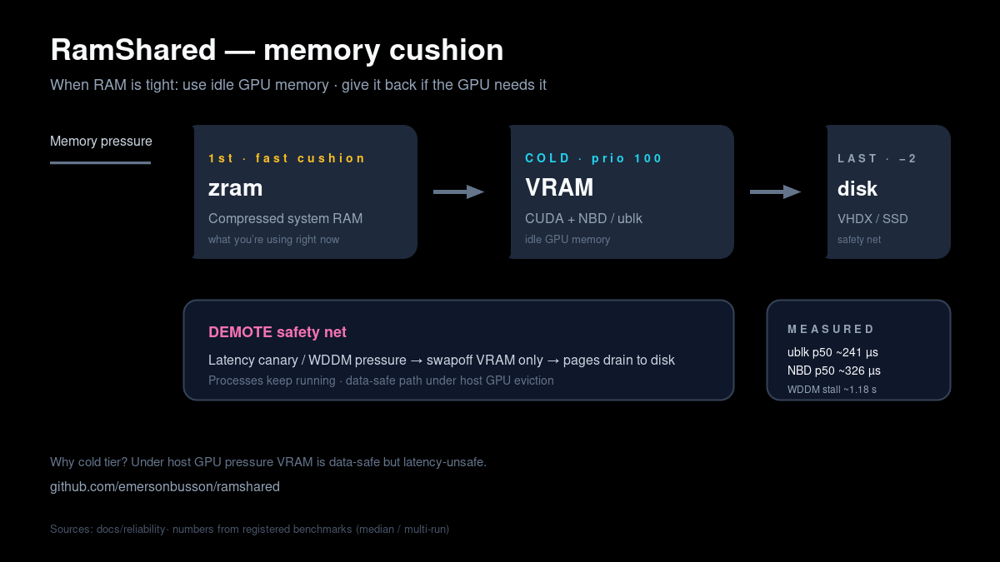
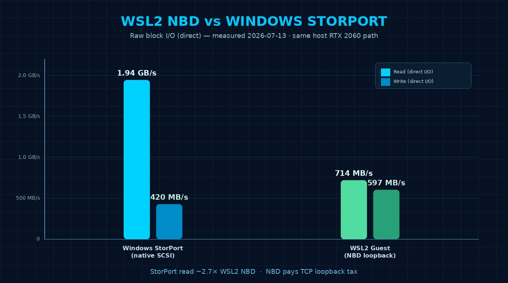

# RamShared

RamShared turns idle NVIDIA VRAM into an elastic memory tier for Linux and
WSL2. It places compressed RAM first, GPU-backed swap second, and disk swap
last. When the GPU needs its budget back, RamShared stops promotion, drains the
GPU tier, and releases the allocation.

It is not extra VRAM for games and it does not inspect application names. A
game, renderer, browser, video editor, or compute job is simply an external GPU
workload. Reclaim decisions use aggregate GPU budget, free-memory, and latency
signals.



<p align="center">
  <a href="https://github.com/emersonbusson/ramshared/releases/tag/v0.7.0"></a>
  
  
  
</p>

## Current Status

Release: **v0.7.0**, published on 2026-07-22.

| Surface | Status | What that means |
| --- | --- | --- |
| Linux/WSL2 cascade | **Product path** | CLI, CUDA/NBD tier, zram/disk cascade, diagnostics, and opt-in systemd boot integration are implemented. |
| Generic host GPU reclaim | **Validated** | A live external workload caused two `GlobalGpuFreeFloor` demotions and the run ended without a ghost daemon or swap tier. |
| WSL2 freeze campaign | **Validated** | Two supervised before/action/after rounds completed with watchdog, binary matching, integrity telemetry, and clean terminal state. |
| Windows StorPort driver | **Supervised beta** | Physical-host and VM drills have passed, including a 3 GiB LUN and supported disk counters. It is not an unattended daily-host install. |
| GiB split matrix | **Partial** | The 1 GiB Windows + 3 GiB WSL2 + external-pressure path passed data checks, but the old installed driver left a virtual LUN after teardown. Reboot, replacement-driver deployment, and clean reruns remain. |
| Custom-kernel ublk transport | **Deferred research** | NBD remains the day-one WSL2 transport. |

The status above is intentionally narrower than the architecture. Open claims
and the exact evidence needed to close them live in
[`docs/reliability/GAP-REGISTER.md`](docs/reliability/GAP-REGISTER.md).

## Quick Start

Requirements:

- Linux or WSL2 with an NVIDIA GPU visible through `nvidia-smi`
- Rust toolchain
- `sudo` access for block-device and swap lifecycle operations

```bash
./scripts/quickstart.sh

sudo ./target/release/ramshared check
sudo ./target/release/ramshared up --vram 1024 --zram 1024
swapon --show
./target/release/ramshared status
```

Start with a bounded allocation such as 1024 MiB. Keep enough VRAM available
for the desktop and other GPU workloads.

Stop through the product lifecycle, never by killing the daemon:

```bash
sudo ./target/release/ramshared down
```

`down` disables GPU-backed swap before stopping its daemon. This ordering is a
data-integrity boundary.

If preflight blocks startup:

```bash
sudo ./target/release/ramshared doctor
./target/release/ramshared status --json
```

Captured JSONL telemetry can be explained locally without sending it to an
external service:

```bash
./target/release/ramshared diagnose --events /path/to/telemetry.jsonl
./target/release/ramshared diagnose --events /path/to/telemetry.jsonl --json
```

## Memory Cascade

```text
memory pressure
    |
    v
zram (compressed system RAM)
    |
    v
idle GPU memory (elastic tier)
    |
    v
disk swap (durable fallback)
```

The control plane watches GPU headroom and operation latency. When the Windows
host or another GPU workload reduces available budget, RamShared:

1. stops promoting pages to the GPU tier;
2. performs a bounded drain of GPU-backed swap;
3. leaves pages in zram or disk swap;
4. releases the CUDA allocation;
5. records the transition and reason in telemetry.

Windows WDDM remains authoritative in WSL2. RamShared reacts to host-visible
pressure; it does not promise that opening a particular application instantly
or risklessly frees a fixed amount of VRAM.

## Safe Operation

- Use `ramshared up` and `ramshared down`; do not force-kill `ramsharedd` while
  its swap device is active.
- Do not allocate the GPU's full physical capacity. A 6 GiB card cannot safely
  host 4 GiB + 1 GiB owners plus a 1 GiB reserve and normal desktop usage.
- Run destructive pressure campaigns only through the supervised watchdog
  harnesses with explicit approval and artifact capture.
- Treat `PARTIAL` as an evidence state, not a test failure and not a release
  claim.
- Never initialize, clear, repartition, or format a disk based only on disk
  number, size, or drive letter.

## Desktop Control

On WSLg or desktop Linux:

```bash
bash scripts/safety/install-cascade-app.sh
./scripts/safety/cascade-app.sh --gui
```

The same lifecycle is available without the GUI:

```bash
./scripts/safety/cascade-app.sh status
sudo ./scripts/safety/cascade-app.sh start
sudo ./scripts/safety/cascade-app.sh stop
```

Root authorization is required only at the device and swap boundary.

## Opt-in Boot Integration

WSL2 needs systemd enabled in `/etc/wsl.conf`. After changing that setting, run
`wsl --shutdown` once from Windows.

```bash
sudo bash scripts/safety/install-cascade-boot.sh --enable
```

The unit performs preflight before startup and uses the ordered `down` path on
stop. Remove it with:

```bash
sudo bash scripts/safety/uninstall-cascade-boot.sh
```

## Installable Bundle

Build the release bundle with:

```bash
scripts/package/build-linux-bundle.sh
```

The output under `artifacts/packages/` contains release binaries, safety
scripts, systemd templates, documentation, and `SHA256SUMS`. Build caches,
credentials, VM-local notes, and Windows driver artifacts are excluded. See
[`docs/packaging/INSTALLABLES.md`](docs/packaging/INSTALLABLES.md).

## Windows Driver Beta

The Windows path is a StorPort virtual miniport backed by GPU memory. It has
passed physical-host and Hyper-V drills, but deployment is still an elevated,
supervised beta workflow.

Important boundaries:

- use a disposable VM for routine driver development;
- use a physical host only for an explicitly approved campaign;
- verify the signed package and running binary match before collecting proof;
- mount the temporary LUN under a private directory when possible, not a
  persistent Explorer drive letter;
- format only an exact `RAMSHARE VRAMDISK` identity that also matches the
  expected size and current campaign owner;
- never use `Clear-Disk`, broad disk-number selection, or physical-disk
  fallback logic;
- drain any pagefile before backend teardown; surprise removal can cause
  Windows bugcheck `0x7A`.

The current physical host still requires one reboot to unload the older driver
and clear its residual 1 GiB virtual LUN. After reboot, the signed replacement
must be deployed and the 1 GiB, 4 GiB, and calibrated 3 GiB + 1 GiB rows rerun
with checksum, reserve restoration, lease release, and no-ghost proof. This is
the open gate, not a completed release claim.

## Performance Evidence

Performance depends on transport, workload, queue depth, host contention, and
GPU pressure. The project records those conditions with each result instead of
publishing one universal speed.

Representative historical measurements on the project workstation:

| Path | Read | Write | Scope |
| --- | ---: | ---: | --- |
| Windows StorPort, 64 MiB LUN | ~1942 MB/s | ~420 MB/s | 50 MiB direct workload, idle host, July 2026 |
| WSL2 NBD loopback | ~714 MB/s | ~597 MB/s | Historical direct block-I/O comparison |



These are environment-specific observations, not minimum guarantees. Source
context and caveats are in [`docs/BENCHMARKS.md`](docs/BENCHMARKS.md) and
[`validation.md`](validation.md).

## Architecture

| Component | Responsibility |
| --- | --- |
| `ramshared` | CLI: preflight, lifecycle, status, doctor, and diagnosis |
| `ramsharedd` | GPU-backed block service |
| `ramshared-tier` | tier policy and demotion safety |
| `ramshared-cuda` | safe wrapper around the NVIDIA/CUDA boundary |
| `ramshared-wsl2d` | WSL2 host-pressure coordination and telemetry |
| `ramshared-agent` | local host observations and explanations |
| `drivers/windows/ramshared` | supervised Windows StorPort beta |

Low-level architecture is documented in [`ARCHITECTURE.md`](ARCHITECTURE.md).
Changes to locks, DMA, allocation ownership, or kernel contracts require SSDV3
specification and named evidence under `docs/specs/`.

## Documentation

| Need | Document |
| --- | --- |
| Installation and common questions | [`docs/FAQ.md`](docs/FAQ.md) |
| Architecture | [`ARCHITECTURE.md`](ARCHITECTURE.md) |
| Current roadmap | [`ROADMAP.md`](ROADMAP.md) |
| Empirical validation log | [`validation.md`](validation.md) |
| Open and closed reliability claims | [`docs/reliability/GAP-REGISTER.md`](docs/reliability/GAP-REGISTER.md) |
| Benchmark context | [`docs/BENCHMARKS.md`](docs/BENCHMARKS.md) |
| Lab VM access and inventory policy | [`docs/labs/HYPERV-VM-ACCESS.md`](docs/labs/HYPERV-VM-ACCESS.md) |
| Contribution rules | [`CONTRIBUTING.md`](CONTRIBUTING.md) |
