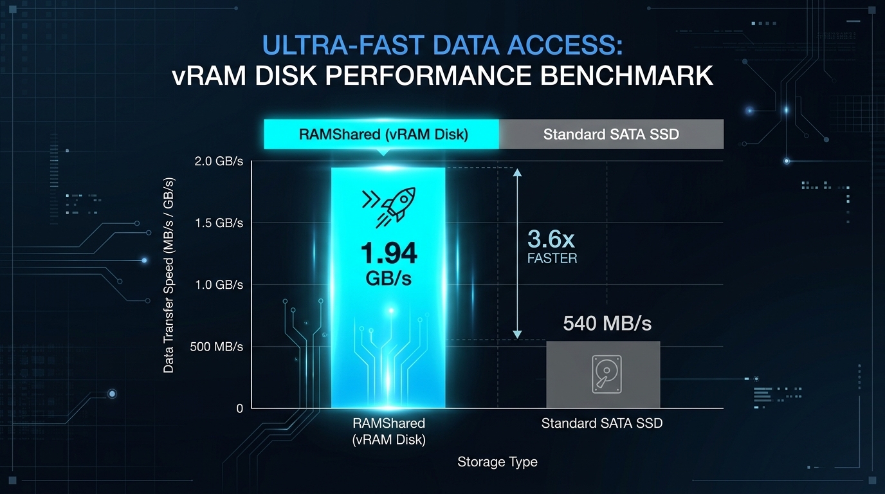

# RamShared

Your PC runs out of RAM. The disk kicks in and everything feels sticky.  
Meanwhile the **GPU often has free memory sitting idle**.

**RamShared borrows that idle GPU memory as a spare cushion — and gives it back when a game or 3D app needs the card.**

That’s it. No magic “free RAM for maxed-out games.” Just more room when you’re compiling, running containers, or drowning in browser tabs.


<p align="center">
  
  
  
</p>

---

## What’s ready today (honest)

| You want… | Ready? |
| --- | --- |
| Use it on **Linux or WSL2** with an NVIDIA GPU | **Yes** — this is the product |
| Turn it on every time WSL boots | **Yes, if you opt in** (script below) |
| Give VRAM back when you open a game on Windows | **Yes by design** (automatic DEMOTE) — you may feel a short slowdown, not a permanent freeze |
| Install a Windows kernel driver on your daily PC | **No** — lab VM only; do not load it on a machine you care about |

We measure things and write down what broke. Details: [validation.md](validation.md), [docs/FAQ.md](docs/FAQ.md).

---

## Try it in a few minutes

**Need:** Linux or WSL2 · NVIDIA GPU (`nvidia-smi` works) · [Rust](https://rustup.rs/) · sudo.

```bash
./scripts/quickstart.sh

sudo ./target/release/ramshared check
sudo ./target/release/ramshared up --vram 1024 --zram 1024
swapon --show
```

You want **about three** emergency-memory lines:

1. **zram** — compressed system RAM (first)  
2. **Something GPU-backed** (often `nbd0`) — idle graphics memory (second)  
3. **Disk / VHDX** — last resort  

```bash
./target/release/ramshared status          # phase: Armed / UsingVram / …
./target/release/ramshared status --json  # machine-readable lifecycle
sudo ./target/release/ramshared down
```

If `check` says blocked, run `sudo ./target/release/ramshared doctor` and fix what it prints.

Start small (`1024` MiB). Don’t grab your whole VRAM if you also game on the same card.

---

## Will this freeze WSL2?

**Normal use is built so it should not.** Freezes we hit in the past came from bad shutdowns (killing the daemon while swap was still on the GPU device). The code now **refuses** that path: it always turns swap off **before** stopping the daemon.

What *can* still happen:

| Situation | What you might feel |
| --- | --- |
| Open a heavy game while the cushion is on | WSL may **slow down for a bit** while pages leave the GPU | 
| Host Windows reclaims GPU memory hard | Tiny reads can take ~**1 second** until demote finishes |
| You force-kill processes / thrash swap on purpose | Don’t. That’s how people hang systems |

**DEMOTE** in plain words: we watch free GPU memory and latency. If the card is hungry, we stop using GPU as swap. Your apps keep running; data slides to disk.

---

## Control app (easier than raw commands)

If you have a desktop in WSL (WSLg) or Linux:

```bash
bash scripts/safety/install-cascade-app.sh
./scripts/safety/cascade-app.sh --gui
```

Buttons: **start / stop / status / check / enable boot / disable boot**.  
Start and stop still need root (`pkexec` or `sudo`) — that is the swap boundary, not busywork.

CLI without GUI:

```bash
./scripts/safety/cascade-app.sh status
sudo ./scripts/safety/cascade-app.sh start
sudo ./scripts/safety/cascade-app.sh stop
```

## Auto-start when WSL boots (opt-in)

Needs **systemd** in the distro (`/etc/wsl.conf` → `[boot]` → `systemd=true`, then `wsl --shutdown` once).

```bash
# From the app: “Enable boot”, or:
sudo bash scripts/safety/install-cascade-boot.sh --enable
```

That unit checks first (refuses dirty state), runs `up`, and on stop runs `down` (swap off first).

Undo: app **Disable boot**, or `sudo bash scripts/safety/uninstall-cascade-boot.sh`.

---

## How the cascade works

```text
Need memory?  →  compressed RAM (zram)     first
              →  idle GPU memory           second
              →  disk                      last
```

If the GPU needs memory back → **give-back (DEMOTE)** → disk holds the pages → apps stay alive.

Numbers we’ve actually seen (not slogans):

| Measurement | Result |
| --- | --- |
| Tiny read under host reclaiming GPU | up to ~**1.18 s** |
| Spill + demote (older run) | ~**511 MiB** out · ~**481 MiB** back · **0** corruption |
| Live demote drill | ~**648 MiB** moved · swapoff ~**15 s** · **0** corruption |

---

## WSL2 vs. Windows Host Memory Management (Coexistence & Demote)

When VRAM is shared between the Windows host and the WSL2 Linux guest, a resource competition arises if both systems demand memory at the same time. RamShared coordinates this dynamically using a host-authoritative **DEMOTE** algorithm.

### How Coexistence and Priority Management Work

This behavior is application-agnostic. A game, a 3D tool, a video editor, or
another GPU workload are only examples of Windows consumers. RamShared does
not wait for a process name; it reacts to the host-authoritative WDDM budget
and free-memory signals. Generic code, scripts, docs, and integration paths
must be named after the role or behavior (`gpu_workload`, `dcc`, `host_agent`),
not after one example application.

1. **WDDM / VidMm Authority:** The Windows Video Memory Manager (VidMm) is the absolute authority over GPU allocation. If a native Windows GPU workload requests VRAM, Windows immediately demands that memory back.
2. **WSL2 Active Monitoring:** The `ramshared-wsl2d` daemon constantly queries `/dev/dxg` (the Direct3D kernel interface inside WSL2) to monitor WDDM budget pressure and VRAM availability.
3. **Triggering Eviction (DEMOTE):** 
   - When host VRAM pressure is detected (free VRAM budget drops below the safety threshold), the Linux guest triggers a **DEMOTE** loop.
   - It stops promoting new pages to VRAM swap (`/dev/nbd0`) and executes a bounded `swapoff` on the VRAM block device.
   - This safely pushes all swapped Linux pages out of VRAM and slides them to the primary disk swap (`/dev/sdc`) or zram.
   - Once usage hits 0, the CUDA memory allocation is released, freeing up VRAM for the Windows application instantly without system hangs or memory corruption.
4. **Windows Host Protection:** On the Windows side, the `ramshared` service polls the pagefile usage and system budget every 5 seconds. Under high memory pressure, it executes an ordered teardown of the virtual disk buffer, vacating pages back to the primary physical SSD (`C:`).

---

## E2E Performance Benchmarks

### WSL2 Guest Swap (NBD loopback) vs. Windows Host Driver (StorPort native)
Raw block-device benchmarks (direct unbuffered read/write) demonstrate the performance profiles of both backends:

| Environment / Interface | Read Throughput | Write Throughput | Latency / Bottleneck |
| --- | --- | --- | --- |
| **Windows Host (StorPort native)** | **~1940 MB/s (1.94 GB/s)** | **~420 MB/s** | Extremely low latency (Direct PCIe memory copy) |
| **WSL2 Guest (NBD loopback)** | **~714 MB/s** | **~597 MB/s** | Network socket boundary overhead (TCP loopback) |


*Key Insight:* The native Windows StorPort driver is **~2.7x faster** for reads compared to the WSL2 guest NBD implementation. This is because the StorPort driver operates directly on the system's SCSI queue and communicates with the backend via shared memory, bypassing the TCP socket loopback boundary required by NBD inside Linux.

---

## Windows Host Driver (Open Beta / MVP)

The Windows swap driver (**ramshared.sys** / StorPort virtual miniport) is now ready for testing on both the Hyper-V guest VM and physical Windows hosts. 

### E2E StorPort Benchmark (vs. Local SATA SSDs)

Continuous, exhaustive stress tests (10 rounds of 50MB random read/write, covering 96% disk capacity) on the physical host demonstrate the following performance comparison:

| Storage Tier / Device | Sustained Read Speed | Sustained Write Speed | Data Integrity (SHA256) |
| --- | --- | --- | --- |
| **RAMShared Virtual Disk (v0.2.0)** | **~1940 MB/s (1.94 GB/s)** | **~420 MB/s** | **100% (Bit-Perfect)** |
| **Samsung 850 EVO 500GB (SATA III)** | ~540 MB/s | ~520 MB/s | 100% |
| **Kingston A400 240GB (SATA III)** | ~500 MB/s | ~350 MB/s | 100% |



*Note:* RAMShared read throughput is **~4x faster** than physical SATA III SSDs, matching PCIe Gen3 NVMe speeds by bypassing disk controller physics and copying directly to VRAM.

### How to Build and Run on a Physical Host
1. **Disable Secure Boot** in your motherboard UEFI/BIOS settings.
2. Enable Windows Test Mode by running these commands in an Administrator PowerShell:
   ```powershell
   bcdedit.exe /set "{current}" testsigning yes
   bcdedit.exe /set "{current}" nointegritychecks yes
   ```
3. Reboot your PC.
4. Run `.\scripts\windows\Build-Drivers.ps1` and `Sign-Drivers.ps1` to compile and sign.
5. Launch the installer and start the backend:
   ```powershell
   # Prefer an unused letter. Script aborts if the letter is already in use
   # or the disk is not a RamShared LUN (anti data-loss guards).
   .\scripts\windows\Install-InfAndBackend.ps1 -FormatNtfs -DriveLetter S
   ```
6. **Optional — boot service (lab SCM):** register `RamSharedWinSvc` so start/stop is ordered on boot:
   ```powershell
   .\scripts\windows\Install-RamSharedService.ps1 -RepoRoot $PWD -StartNow
   ```
   Stop refuses to kill the backend while a secondary pagefile on the volume is still allocated (DT-9 / BugCheck **0x7A**).

**Partition / format safety:** `Install-InfAndBackend.ps1` and `Start-RamSharedLab.ps1` only format disks that match the RamShared virtual LUN identity. They refuse if the target drive letter is already mounted on another volume, unless you pass `-Force` after an interactive confirmation path. Never point these scripts at a physical OS disk.

*Warning:* Surprise-removing the virtual storage back-end while a pagefile on it is actively in use will cause a bugcheck (**0x7A**). Avoid stopping the backend while the pagefile is active.

---

<details>
<summary>Português (resumo direto)</summary>

### O que é
Quando a RAM aperta, usa VRAM ociosa como colchão e **devolve** se a placa precisar (jogo, render).

### Usar
```bash
./scripts/quickstart.sh
sudo ./target/release/ramshared check
sudo ./target/release/ramshared up --vram 1024 --zram 1024
swapon --show
sudo ./target/release/ramshared down
```

### Boot automático (opcional)
```bash
sudo bash scripts/safety/install-cascade-boot.sh --enable
```

### Trava o WSL?
Uso normal: desenhado para **não**. Demote pode deixar lento por alguns segundos. Não mate o daemon na mão com swap ainda ativo.

### Driver de vRAM no Windows Físico?
**Sim (Fase Beta / MVP).** Exige desativar o **Secure Boot** na BIOS e ativar o **Modo de Testes** (`bcdedit /set testsigning yes`) para compilar e carregar o driver localmente.

### Coexistência e Gerenciamento de Memória (Windows vs. WSL2)
* **WDDM é a autoridade:** O Windows Video Memory Manager (VidMm) manda na VRAM. Se um jogo ou app no Windows exigir memória, o daemon do WSL2 monitora essa pressão via `/dev/dxg` e dispara o processo de **DEMOTE** (desalocando páginas do swap NBD da GPU para o disco) para liberar espaço no Windows host instantaneamente.
* **Performance Comparada:** A leitura nativa via StorPort no Windows atinge **~1.94 GB/s** (4x mais rápido que SSDs SATA III), enquanto no WSL2 a leitura fica em **~714 MB/s** devido ao overhead da camada de loopback NBD. Gráficos: [WSL2 vs StorPort](docs/marketing/benchmark-wsl2-vs-storport.jpg) e [StorPort vs SATA](docs/marketing/benchmark-comparison.jpg).

</details>

---

## Docs & code map

| If you need… | Open |
| --- | --- |
| Plain FAQ | [docs/FAQ.md](docs/FAQ.md) |
| How it’s built | [ARCHITECTURE.md](ARCHITECTURE.md) |
| What’s done / next | [ROADMAP.md](ROADMAP.md) |
| Live “did it work?” log | [validation.md](validation.md) |
| Boot feature (SSDV3) | [docs/specs/no-milestone/wsl2-cascade-boot/](docs/specs/no-milestone/wsl2-cascade-boot/) |
| Windows lab | [docs/specs/no-milestone/windows-swap-driver/](docs/specs/no-milestone/windows-swap-driver/) |
| Native kernel research (WSL/Ubuntu phases) | [docs/specs/no-milestone/wsl2-native-vram-tier/PRD.md](docs/specs/no-milestone/wsl2-native-vram-tier/PRD.md) |
| Contributing | [CONTRIBUTING.md](CONTRIBUTING.md) |

| Crate / tree | Role |
| --- | --- |
| `ramshared` CLI | check, doctor, up, down, status |
| `ramsharedd` | serves GPU memory over NBD |
| `ramshared-tier` | priorities + demote safety net |
| `ramshared-cuda` | NVIDIA driver (only `unsafe` boundary) |
| `drivers/windows/` | StorPort lab only |

Patches that touch locks, DMA, or kernel contracts go through SSDV3 under `docs/specs/…`.  
**Languages:** **Rust** for the WSL product (daemon/CLI); **C** (kernel style) for any real Linux kernel work; dual-boot is optional research, not required to use the cascade.
