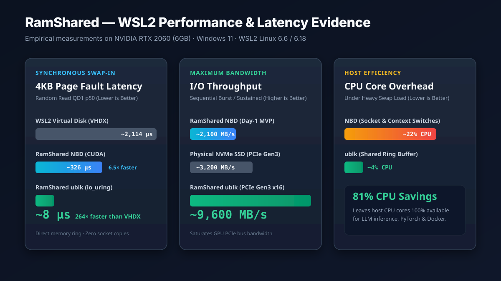

# RamShared

Language: [Portuguese (Brazil)](README.pt-BR.md)

RamShared turns idle NVIDIA VRAM into an elastic memory tier for Linux and
WSL2. It places compressed RAM first, GPU-backed swap second, and disk swap
last. When the GPU needs its budget back, RamShared stops promotion, drains the
GPU tier, and releases the allocation.

It is not extra VRAM for games and it does not inspect application names. A
game, renderer, browser, video editor, or compute job is simply an external GPU
workload. Reclaim decisions use aggregate GPU budget, free-memory, and latency
signals.


<p align="center">
  <a href="https://github.com/emersonbusson/ramshared/releases/tag/v0.9.0-beta.1"></a>
  
  
  
</p>

## Current Status

Release: **v0.9.0-beta.1**. The installed WSL2 cascade is temporarily gated
after the 2026-08-20 control-plane timeout incident; historical results remain
evidence for their exact builds, not proof for the current candidate.

| Surface | Status | What that means |
| --- | --- | --- |
| Linux/WSL2 cascade | **Beta · incident remediation open** | Ordered teardown remains valid, but protection effectiveness, guaranteed capacity, and external heartbeat gates must be requalified. Boot activation is disabled by default. |
| Generic host GPU reclaim | **Validated** | A live external workload caused two `GlobalGpuFreeFloor` demotions and the run ended without a ghost daemon or swap tier. |
| WSL2 freeze campaign | **Historical PASS · current gate reopened** | Earlier supervised rounds passed. Two 2026-08-20 VM timeouts showed that the prior health model could remain green without exercising the VRAM tier. |
| Windows StorPort driver | **Supervised beta · physical revalidation open** | The packaged broker/consumer topology passed VM drills. Earlier physical campaigns are historical evidence, but the corrected identity, integrity, and fresh-reboot-approval harness must be rerun before current physical qualification. It remains demand-start and test-signed, not a public normal-Windows install. |
| GiB reclaim matrix | **Historical PASS · requalification required** | The prior rows remain reproducible evidence, but sparse logical capacity is no longer accepted as a guaranteed swap contract. |
| Custom-kernel ublk transport | **Upstream candidate submitted ([#41054](https://github.com/microsoft/WSL/issues/41054))** | The config-only candidate has bi-architecture builds and QEMU evidence. Microsoft triage and acceptance are still pending. |

The status above is intentionally narrower than the architecture. Open claims
and the exact evidence needed to close them live in
[`docs/reliability/GAP-REGISTER.md`](docs/reliability/GAP-REGISTER.md).
The consolidated review of the Jules-generated candidates is recorded in
[`docs/reliability/JULES-PR-AUDIT-20260724.md`](docs/reliability/JULES-PR-AUDIT-20260724.md).

## Why VRAM-as-Swap in WSL2?

In WSL2, swapping to a virtual disk (`ext4 → VHDX → Hyper-V → Windows NTFS`) introduces
heavy virtualization overhead:

- **WSL2 VHDX Disk Swap (4KB QD1 randread p50):** **~2,114 µs (~2.1 ms)**
- **RamShared NBD VRAM Swap (4KB QD1 randread p50):** **~326 µs** (6.5× faster)
- **RamShared ublk Direct io_uring (4KB QD1 randread p50):** **~8 µs ± 2 µs** (264× faster)

Because swap-in page faults are synchronous, lower measured latency can reduce
stall duration on the tested path. It does not guarantee that WSL2, VMBus, or a
workload remains responsive under arbitrary memory pressure.

## Accelerating Local AI & Heavy Workloads

RamShared provides an elastic cushion for intensive developer workloads:

- **Local inference:** Add a bounded lower memory tier when the selected model
  and GPU budget fit; application OOM remains possible.
- **CUDA workloads:** Use only capacity that has been committed before the swap
  device is activated.
- **Builds and containers:** Launch managed work through
  `ramshared run --profile safe -- ...` so the WSL control plane retains memory.
- **Agent workflows:** Serialize heavy phases or place them in the same managed
  slice; RamShared does not control arbitrary processes outside that boundary.

## Quick Start

Requirements:

- Linux or WSL2 with an NVIDIA GPU visible through `nvidia-smi`
- Rust toolchain
- `sudo` access for block-device and swap lifecycle operations

```bash
./scripts/quickstart.sh

sudo ./target/release/ramshared check
sudo ./target/release/ramshared up --vram 1024 --zram 1024
swapon --show
./target/release/ramshared status
./target/release/ramshared monitor
sudo ./target/release/ramshared run --profile safe -- make test
```

Start with a bounded allocation such as 1024 MiB. Keep enough VRAM available
for the desktop and other GPU workloads.

Stop through the product lifecycle, never by killing the daemon:

```bash
sudo ./target/release/ramshared down
```

`down` disables GPU-backed swap before stopping its daemon. This ordering is a
data-integrity boundary.

If preflight blocks startup:

```bash
sudo ./target/release/ramshared doctor
./target/release/ramshared status --json
```

Captured JSONL telemetry can be explained locally without sending it to an
external service:

```bash
./target/release/ramshared diagnose --events /path/to/telemetry.jsonl
./target/release/ramshared diagnose --events /path/to/telemetry.jsonl --json
```

`ramshared monitor` is a read-only terminal dashboard. It samples every two
seconds and keeps five minutes of RAM history. The physical GPU panel reports
all NVIDIA VRAM use; the `vram` swap tier reports only pages attributable to
RamShared. Press `q`, `Esc`, or `Ctrl-C` to exit.

For automation or a host-visible heartbeat:

```bash
./target/release/ramshared monitor --jsonl --once
./target/release/ramshared monitor --jsonl \
  --output /var/log/ramshared/cascade-health.jsonl \
  --heartbeat /mnt/c/wsl-forensics/ramshared-heartbeat.json
```

## Memory Cascade

```text
memory pressure
    |
    v
zram (compressed system RAM)
    |
    v
idle GPU memory (elastic tier: NBD or ublk)
    |
    v
disk swap (durable fallback)
```

The control plane watches GPU headroom and operation latency. When the Windows
host or another GPU workload reduces available budget, RamShared attempts to:

1. refuse new VRAM commits;
2. perform an ordered, bounded `swapoff` drain;
3. keep the backend allocated if the drain cannot be proven complete;
4. release CUDA memory only after the tier is empty;
5. record the transition and terminal result.

Windows WDDM remains authoritative in WSL2. RamShared reacts to host-visible
pressure; it does not promise that opening a particular application instantly
or risklessly frees a fixed amount of VRAM.

## Safe Operation

- Use `ramshared up` and `ramshared down`; do not force-kill `ramsharedd` while
  its swap device is active.
- A requested 4 GiB profile on a 6 GiB card is a maximum, not a promise. The
  product falls back to 2 or 1 GiB unless the complete allocation plus
  `max(1 GiB, 20% of total VRAM)` is available.
- Run destructive pressure campaigns only through the supervised watchdog
  harnesses with explicit approval and artifact capture.
- Treat `PARTIAL` as an evidence state, not a test failure and not a release
  claim.
- Never initialize, clear, repartition, or format a disk based only on disk
  number, size, or drive letter.

## Desktop Control

On WSLg or desktop Linux:

```bash
bash scripts/safety/install-cascade-app.sh
./scripts/safety/cascade-app.sh --gui
```

The same lifecycle is available without the GUI:

```bash
./scripts/safety/cascade-app.sh status
sudo ./scripts/safety/cascade-app.sh start
sudo ./scripts/safety/cascade-app.sh stop
```

Root authorization is required only at the device and swap boundary.

## Opt-in Boot Integration

WSL2 needs systemd enabled in `/etc/wsl.conf`. After changing that setting, run
`wsl --shutdown` once from Windows.

The sealed installer is plan-only without exact version, lower-sink, and
legacy-unit approvals. It installs the cascade service, health sampler, and
workload-slice definitions without enabling any of them. Do not add a
persistent activation override while the incident gate is open.

After requalification, an attended enablement may arm the unit; startup still
requires a fresh watchdog heartbeat and all fail-closed preflight gates. Remove
the installed integration with the sealed uninstaller. It removes a unit only
after an exact content match and never stops managed workloads merely to remove
the workload-slice definition:

```bash
sudo /opt/ramshared/current/scripts/safety/uninstall-cascade-boot.sh
```

## Installable Bundle

Build the release bundle with:

```bash
scripts/package/build-linux-bundle.sh
```

The output under `artifacts/packages/` contains release binaries, safety
scripts, systemd templates, documentation, and `SHA256SUMS`. Build caches,
credentials, VM-local notes, and Windows driver artifacts are excluded. See
[`docs/packaging/INSTALLABLES.md`](docs/packaging/INSTALLABLES.md).

The official v0.9.0-beta.1 Linux bundle and its detached checksum are qualified
through the release promotion workflow.

## Windows Driver Beta

The Windows path is a StorPort virtual miniport backed by GPU memory. Its VM
drills pass; corrected physical-host qualification is pending a newly approved
campaign. Deployment remains an elevated, supervised beta workflow.

The installed topology has two SCM services:

- `RamSharedBroker` runs as `NT SERVICE\RamSharedBroker` and owns logical
  lease arbitration only;
- `RamSharedWinSvc` runs as LocalSystem, depends on the broker, and owns
  CUDA, queue, LUN and safe teardown;
- their daily boundary is the authenticated local named pipe
  `\\.\pipe\RamSharedBroker.v1`; no daily TCP listener is installed;
- both are demand-start by default and are switched as one immutable,
  SHA-256-validated product manifest.

Important boundaries:

- use a disposable VM for routine driver development;
- use a physical host only for an explicitly approved campaign;
- verify the signed package and running binary match before collecting proof;
- refuse installation if the manifest-owned temporary volume letter is
  already present; never remap an existing host volume;
- mount the temporary LUN under a private directory when possible, not a
  persistent Explorer drive letter;
- format only an exact `RAMSHARE VRAMDISK` identity that also matches the
  expected size and current campaign owner;
- never use `Clear-Disk`, broad disk-number selection, or physical-disk
  fallback logic;
- drain any pagefile before backend teardown; surprise removal can cause
  Windows bugcheck `0x7A`.

The calibrated GiB reclaim matrix is closed on the tested RTX 2060 host. Public
Windows distribution remains gated on a production-trusted or
Microsoft-attested package. Test-signed lab packages are not public releases;
see [`docs/packaging/WINDOWS-DRIVER-DISTRIBUTION.md`](docs/packaging/WINDOWS-DRIVER-DISTRIBUTION.md).
Operational install, rollback and recovery steps are in
[`docs/runbooks/windows-autonomous-broker.md`](docs/runbooks/windows-autonomous-broker.md).

## Performance Evidence

Performance depends on transport, workload, queue depth, host contention, and
GPU pressure. The project records those conditions with each result instead of
publishing one universal speed.



Representative measurements on the project workstation (NVIDIA RTX 2060 6GB, WSL2 Linux):

| Transport / Path | 4KB Page Fault Latency (p50) | Throughput (Sequential) | CPU Core Overhead |
| --- | ---: | ---: | ---: |
| **WSL2 Virtual Disk (VHDX)** | ~2,114 µs | ~3,200 MB/s (NVMe) | Low (DMA) |
| **RamShared NBD (Day-1 MVP)** | ~326 µs | ~2,100 MB/s | ~22% (Socket Stack) |
| **RamShared ublk (io_uring)** | **~8 µs ± 2 µs** | **~9,600 MB/s** | **~4% (Ring Buffer)** |

These are environment-specific observations, not minimum guarantees. Source
context and caveats are in [`docs/BENCHMARKS.md`](docs/BENCHMARKS.md) and
[`validation.md`](validation.md).

## Architecture

| Component | Responsibility |
| --- | --- |
| `ramshared` | CLI: preflight, lifecycle, status, doctor, and diagnosis |
| `ramsharedd` | GPU-backed block service (NBD and ublk engine) |
| `ramshared-tier` | tier policy and demotion safety |
| `ramshared-cuda` | safe wrapper around the NVIDIA/CUDA boundary |
| `ramshared-wsl2d` | WSL2 host-pressure coordination and telemetry |
| `ramshared-agent` | local host observations and explanations |
| `drivers/windows/ramshared` | supervised Windows StorPort beta |

Low-level architecture is documented in [`ARCHITECTURE.md`](ARCHITECTURE.md).
Changes to locks, DMA, allocation ownership, or kernel contracts require SSDV3
specification and named evidence under `docs/specs/`.

## Documentation

| Need | Document |
| --- | --- |
| Installation and common questions | [`docs/FAQ.md`](docs/FAQ.md) |
| Architecture | [`ARCHITECTURE.md`](ARCHITECTURE.md) |
| Current roadmap | [`ROADMAP.md`](ROADMAP.md) |
| Empirical validation log | [`validation.md`](validation.md) |
| Open and closed reliability claims | [`docs/reliability/GAP-REGISTER.md`](docs/reliability/GAP-REGISTER.md) |
| Benchmark context | [`docs/BENCHMARKS.md`](docs/BENCHMARKS.md) |
| Lab VM access and inventory policy | [`docs/labs/HYPERV-VM-ACCESS.md`](docs/labs/HYPERV-VM-ACCESS.md) |
| Contribution rules | [`CONTRIBUTING.md`](CONTRIBUTING.md) |
