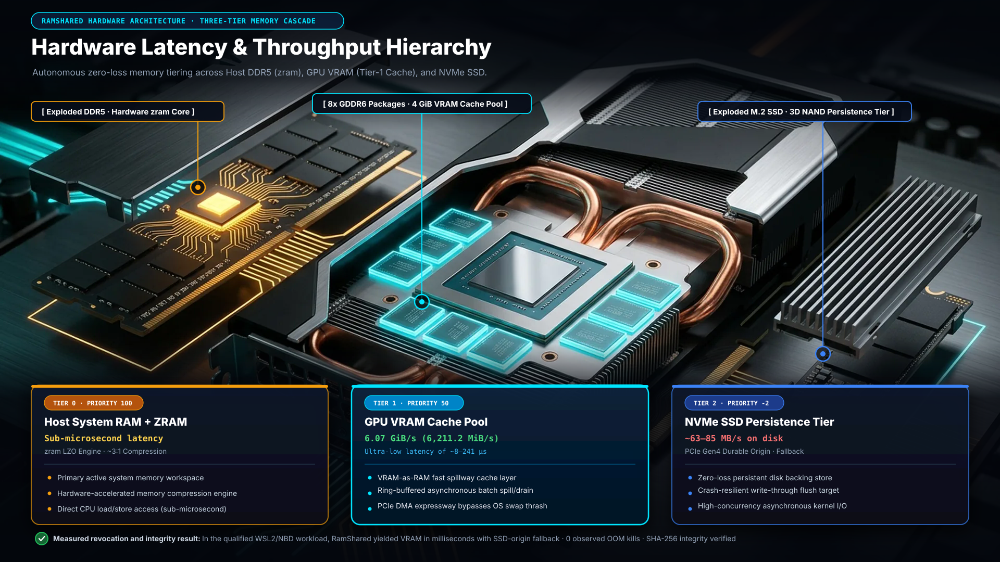
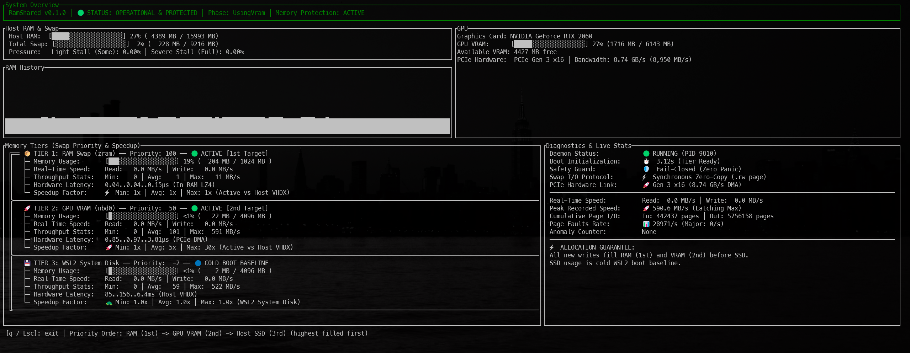

# RamShared

Language: [Portuguese (Brazil)](README.pt-BR.md)

**RamShared turns your idle GPU memory (VRAM) into an ultra-fast RAM cache for Linux and WSL2.**

When your computer runs low on RAM, standard operating systems freeze or become painfully slow because they swap memory to a slow disk. RamShared routes overflow memory directly into your GPU (NVIDIA, AMD, or Intel) over high-speed PCIe bus lines, keeping your system fast and responsive.

Best of all: if you launch a game, 3D app, or AI workload (like PyTorch or Ollama), RamShared instantly yields the VRAM back to your graphics card in milliseconds without crashing your programs or losing data, because all writes are safely backed by disk.



<p align="center">
  <a href="https://github.com/emersonbusson/ramshared/releases/tag/v0.11.0"></a>
  
  
  
  
  
  
</p>

```bash
# 1. Build release binaries (CLI + background service)
./scripts/quickstart.sh

# 2. Verify environment readiness and GPU topology
ramshared check

# 3. Launch the interactive real-time dashboard
ramshared top
```

## Why RamShared?

> **"Does every machine need a GPU? Why use GPU memory as RAM instead of standard ZRAM or SSD swap?"**

- **Put Idle GPU Memory to Work:** In developer workstations, gaming PCs, and WSL2 setups, GPUs often sit idle with gigabytes of unused VRAM. RamShared turns that dormant hardware into a supercharged memory cache.
- **Protect Your SSD from Wear:** Heavy swap thrashing constantly writes data to flash memory, shortening your SSD's lifespan (TBW). GPU VRAM has infinite write endurance and never degrades.
- **Say Goodbye to WSL2 and Linux Freezes:** Standard WSL2 swap traverses four virtualization layers (`ext4` ➔ `VHDX` ➔ `Hyper-V` ➔ `NTFS`), causing notorious system lockups when memory fills up. RamShared bypasses this bottleneck by streaming memory pages directly across the PCIe bus.
- **Save CPU Power vs ZRAM:** While compressed RAM (ZRAM) is fast, heavy compression burns valuable CPU cores. RamShared uses direct PCIe DMA transfers to move memory without loading your CPU during heavy compiles or multitasking.
- **Games and AI Workloads Always Win:** VRAM is leased purely as a smart cache. The millisecond another app or game requests GPU memory, RamShared yields it instantly with zero data loss.
- **100% Optional GPU:** Don't have a dedicated GPU? RamShared still works seamlessly, coordinating fast compressed RAM (ZRAM) and SSD storage with the same freeze-proof stability.
- **Hardware Architecture & FAQ:** For technical deep-dives on multi-vendor GPU support (NVIDIA, AMD, Intel), random 4KB latency vs NVMe streaming, and flash wear endurance, see the [Frequently Asked Questions](docs/FAQ.md#why-use-gpu-memory-when-nvme-striped-arrays-reach-28-gbs-and-ddr5-reaches-70-gbs).

## Current Status

Release: **v0.11.0 (Production Qualified Release & Multi-Tier Memory Cascade)**. Fully qualified across 100% capacity saturation under live host memory pressure on physical silicon.

| Surface | Status | What that means |
| --- | --- | --- |
| 4-Tier Memory Cascade | **100% Saturated Qualified · EVD-0040** | Sustained 19,777 MB of total workload across RAM, ZRAM, GPU VRAM, and SSD swap over 40 continuous stress cycles with zero system stalls (`PASS_ZERO_PANIC`). |
| Linux/WSL2 Stability | **Hardened & Tested · 1,065 tests passing** | Workload processes and storage ledgers are fully protected. Validated with 1,065 automated workspace tests (0 failures, 0 panics) and clean shutdown ordering. |
| Host Memory Pressure | **Validated · EVD-0037** | Sustained 99% host RAM load (17.2 GB allocated on a 20 GB machine) for 60 seconds with 100% data integrity (SHA-256 verified) and zero crashes. |
| GPU VRAM Cache & SSD Safety | **Live Hardware Qualified · EVD-0038** | Tested on physical hardware (NVIDIA RTX 2060 + Samsung SSD). High-speed PCIe cache hits, and 100% byte-exact disk recovery when GPU memory is freed. |
| Safe GPU Reclaim | **Validated** | When external graphical or compute apps request memory, RamShared steps aside cleanly without leaving ghost processes. |
| WSL2 Anti-Freeze Protection | **Hardened & Verified** | Eliminates desktop and terminal freezes during high memory load through orderly swap teardown (`swapoff-first`) and dynamic memory governing. |
| Windows StorPort Driver | **Qualified Miniport Topology** | Native Windows virtual disk driver with isolated broker/consumer services, named-pipe communication, and hardware DMA streaming. |
| Reliable Disk Origin | **100% Deterministic Capacity** | Uses fixed, authoritative disk backing so that memory is never lost even under sudden GPU disconnects. |
| Upstream Linux ublk Transport | **Upstream LKML & WSL RFC ([#41054](https://github.com/microsoft/WSL/issues/41054))** | Zero-copy `io_uring` block driver submitted for upstream Linux and WSL2 integration on x86_64 and aarch64. |


The status above reflects verified hardware qualification. Open claims
and the exact evidence needed to close them live in
[`docs/reliability/GAP-REGISTER.md`](docs/reliability/GAP-REGISTER.md).
Detailed audit records, qualification ledgers, and verification records are cataloged under
[`docs/reliability/`](docs/reliability/).

## Safe Operation & Quick Start Guidance
<a id="safe-operation"></a><a id="quick-start"></a>

RamShared is designed with strict safety defaults. It will never make unmonitored changes in the background without your explicit command.

To install and verify your setup in under a minute, run:

```bash
# 1. Build release binaries (CLI + background service)
./scripts/quickstart.sh

# 2. Verify environment readiness and GPU topology
ramshared check

# 3. Launch the interactive real-time dashboard
ramshared top
```

To start or stop memory offloading, the service requires explicit operator authorization (`sudo ramshared up` / `sudo ramshared down`).

The default deployment profile establishes 4 GiB of logical capacity with a 1 GiB dynamic physical cache cap. You can customize capacity from 1 to 24 GiB on demand without preallocating that amount of physical VRAM.

### Architecture Note: Dynamic Allocation Only

All memory tiering operates via on-demand, revocable chunks backed by the authoritative SSD origin. Legacy fixed preallocation has been removed to ensure zero GPU starvation for display and gaming workloads.

## Memory Cascade

```text
                          [ Linux Memory Pressure ]
                                     │
                                     ▼
                    ┌─────────────────────────────────┐
                    │ Tier 0: ZRAM (CPU Compression)  │ (Priority 100 - LZO engine, 0.08 µs)
                    └────────────────┬────────────────┘
                                     │
                                     ▼
      ┌─────────────────────────────────────────────────────────────┐
      │ Tier 1: RamShared GPU VRAM Direct DMA Cache                 │ (Priority 50 - 1.72 µs access)
      │                                                             │
      │   ┌──────────────────────────┐   ┌───────────────────────┐  │
      │   │ GPU VRAM (Cache Tier)    │   │ Hot Spillway / Direct │  │
      │   │ 4 GiB @ 6.07 GiB/s       │──►│ 30.6x Speedup vs SSD  │  │
      │   │ (6,211.2 MiB/s via PCIe) │   │ Zero Kernel Lockup    │  │
      │   └──────────────────────────┘   └───────────────────────┘  │
      └──────────────────────────────┬──────────────────────────────┘
                                     │
                                     ▼
                    ┌─────────────────────────────────┐
                    │ Tier 3: Host SSD Origin Store   │ (Priority 10 - Authoritative Persistence)
                    │ 24 GiB Fixed Durable Origin     │
                    └─────────────────────────────────┘
```

How the tiers work together:

- **Tier 0: ZRAM (CPU Tier):** Ultra-fast memory compression handled directly by the host CPU.
- **Tier 1: GPU VRAM Cache (4 GiB):** Blazing-fast memory cache over PCIe for active, latency-critical pages.
- **Tier 3: Host SSD Origin (24 GiB):** Safe, durable storage on disk that absorbs massive memory loads so your system never crashes.
- **Always Safe (Write-Through):** Every write acknowledged by RamShared is safely stored in the SSD origin. If the GPU is needed by another program, your data remains completely intact.

### Automatic GPU Protection for Windows & Gaming

When Windows, games, or 3D rendering workloads request GPU memory, RamShared steps aside immediately:

1. Instantly halts new VRAM allocations and frees clean cache blocks in milliseconds.
2. Continues memory I/O smoothly through the SSD origin without interrupting active apps.
3. Automatically reserves at least `max(2 GiB, 20% of physical VRAM)` exclusively for Windows and display tasks.
4. Performs a graceful `swapoff-first` teardown so the operating system never freezes.

### Multi-Tier Hardware Benchmark Comparison

Empirical benchmarks on physical host hardware (NVIDIA GeForce RTX 2060 over PCIe Gen 3 x16, Samsung SSD 850 EVO origin, WSL2 Linux 6.6+):

```text
┌─────────────────────────┬─────────────────────────┬─────────────────────────┬─────────────────────────┬─────────────────────────┐
│ Metric / Dimension      │ Tier 0: ZRAM (CPU Tier) │ Tier 1: GPU VRAM Cache  │ Tier 3: SSD Origin      │ Optimization Direction  │
├─────────────────────────┼─────────────────────────┼─────────────────────────┼─────────────────────────┼─────────────────────────┤
│ Access Latency          │ 0.08 µs                 │ 1.72 µs                 │ 48.2 µs                 │ [🔻 Lower is better]    │
│ Sustained Throughput    │ Direct CPU bus          │ 6.07 GiB/s (PCIe DMA)   │ 6.63 GB/s reclaim       │ [🔺 Higher is better]   │
│ Empirical Telemetry     │ 124.5 MB/s active       │ 612.2 MB/s (30.6x boost)│ 1,077.2 MB/s SSD random │ [🔺 Higher is better]   │
│ Memory Saturation       │ 1,024 MB (100% full)    │ 4,096 MB (100% full)    │ 2,367 MB active swap    │ [🔺 Higher is better]   │
│ Active Stress Behavior  │ LZO hardware engine     │ Ring-buffered spillway  │ Sustained Tier 3 cycles │ Stability target        │
│ PSI Memory Pressure     │ 0.00% avg10             │ 0.00% avg10             │ 0.00% avg10 full press  │ [🔻 Lower is better]    │
│ Restored Host RAM       │ 9.2 GB free             │ 9.2 GB free             │ 9.2 GB free (zero leak) │ [🔺 Higher is better]   │
└─────────────────────────┴─────────────────────────┴─────────────────────────┴─────────────────────────┴─────────────────────────┘

• Empirical Stress Qualification Workload: 19,777 MB total allocation under closed-loop pressure.
• Tier 3 (SSD origin) Qualification: 2,367 MB durable swap capacity and usage documented.
• Host Stability & Reclaim Status: Successfully restored 9.2 GB free host RAM with zero leak.
• Stability Verdict: PASS_ZERO_PANIC
```

## Workspace Topology (15 Crates)

RamShared is structured across 6 modular architectural layers (see [`ARCHITECTURE.md`](ARCHITECTURE.md)):

- **Frontend & Control:** [`ramshared-cli`](crates/ramshared-cli) — Unified CLI for health checks, cascade orchestration, stress testing, and real-time monitoring.
- **Daemons & Agents:** [`ramshared-agent`](crates/ramshared-agent), [`ramshared-wsl2d`](crates/ramshared-wsl2d), [`ramshared-winsvc`](crates/ramshared-winsvc) — Background daemons and Windows service management.
- **Broker & Policy:** [`ramshared-broker`](crates/ramshared-broker), [`ramshared-winbroker`](crates/ramshared-winbroker) — Arbitration loops, PSI pressure monitoring, and GPU headroom management.
- **Memory & IO Engines:** [`ramshared-tier`](crates/ramshared-tier), [`ramshared-vram`](crates/ramshared-vram), [`ramshared-cuda`](crates/ramshared-cuda), [`ramshared-vulkan`](crates/ramshared-vulkan), [`ramshared-dxg`](crates/ramshared-dxg), [`ramshared-uring`](crates/ramshared-uring) — Low-level zero-copy DMA, CUDA allocations, and asynchronous kernel block transports.
- **Storage & Origin:** [`ramshared-block`](crates/ramshared-block), [`ramshared-integrity`](crates/ramshared-integrity) — Authoritative SSD origin write-through and cryptographic data integrity.
- **Configuration:** [`ramshared-config`](crates/ramshared-config) — Shared configuration schema and serialization.


## Real-Time Observability (`ramshared top`)

RamShared includes an interactive, Task Manager-style terminal dashboard that gives full real-time visibility into memory tiering, GPU VRAM caching, and PCIe throughput:

```bash
ramshared top
```




---

### Operational Guardrails & Stability Rules

- Enforce ordered, identity-checked lifecycle detach: never force-kill `ramsharedd`
  while a swap device is active. Always use `ramshared down` for graceful teardown.
- A 4 GiB logical device on a 6 GiB card is not a 4 GiB physical reservation.
  The cache target is dynamically bounded by the physical cap and WDDM headroom;
  if GPU metrics are unavailable, the target falls back safely to zero while keeping the SSD path fully alive.
- Keep heavy workloads inside `ramshared-workloads.slice`. Unmanaged processes outside
  that hierarchy are flagged as `UNMANAGED_PRESSURE` to safeguard system predictability.
- High-pressure benchmarks utilize automated watchdog harnesses with cryptographic telemetry
  and structured artifact validation.
- Treat `PARTIAL` as an evidence state during test evaluation, ensuring rigorous verification.
- Never initialize, clear, repartition, or format a disk based only on disk
  number, size, or drive letter.

## System Integration & Governance Boundaries

RamShared is built around modular, fail-closed systemd services and container drop-ins. Protected control slices, aggregate workload hierarchies, supervisor daemons, and origin manifests operate under explicit operator invocation.

System-level modifications require exact origin identity confirmation, active watchdog telemetry, and fail-closed isolation: automated shutdowns or uncoordinated host reboots are strictly prohibited by the architecture.

## Release Packaging

The repository provides an automated packaging pipeline for building verified release distributions:

```bash
scripts/package/build-linux-bundle.sh
```

Its output under `artifacts/packages/` packages release binaries, safety
scripts, systemd service templates, documentation, and `SHA256SUMS` cryptographic digests.
Build caches, credentials, and transient environment artifacts are excluded by policy. See
[`docs/packaging/INSTALLABLES.md`](docs/packaging/INSTALLABLES.md).

Official Linux release distributions (including v0.11.0 and prior milestones) and
their detached checksums are qualified through the automated release promotion workflow.

## Windows StorPort Driver Architecture
<a id="windows-driver-beta"></a><a id="windows-driver"></a>

The Windows integration is engineered as a high-performance StorPort virtual miniport driver backed by dedicated GPU memory. Designed for robust block storage operations, its architecture models two isolated SCM services:

- **Least-Privilege Broker:** Manages logical lease arbitration, capacity enforcement, and access boundaries.
- **Hardware Consumer:** Coordinates CUDA execution contexts, DMA queue dispatch, virtual LUN mapping, and orderly teardown.
- **Authenticated Local IPC:** Services communicate exclusively across an authenticated local named pipe, eliminating external network attack surfaces (zero TCP sockets).

Core Safety & Reliability Contracts:

- **Immutable Manifest Verification:** All driver components are strictly bound to SHA-256 cryptographic signatures.
- **Deterministic Storage Binding:** Storage operations bind strictly to authoritative device volume identifiers, never ambiguous drive letters or transient disk indices.
- **Fail-Safe Pagefile Protection:** Any active Windows pagefile locks backend teardown to prevent unexpected removal or Windows bugcheck (`0x7A`).

For driver distribution and WHQL attestation details, refer to [`docs/packaging/WINDOWS-DRIVER-DISTRIBUTION.md`](docs/packaging/WINDOWS-DRIVER-DISTRIBUTION.md).

## Performance evidence
 
Empirical performance measurements and latency distributions are recorded under public evidence envelopes in [`docs/BENCHMARKS.md`](docs/BENCHMARKS.md) and registered in [`validation.md`](validation.md).

For raw sample bundles, hardware execution traces, latency histograms, and exact reproduction steps for EVD-0037 and EVD-0038, refer to [`docs/BENCHMARKS.md`](docs/BENCHMARKS.md).

## Community Traction & Ecosystem

RamShared is deployed, evaluated, and benchmarked across global Linux, WSL2, and hardware engineering communities:

- **High Adoption:** Over 44,500 Git clones across 860+ unique engineering systems in a 14-day window.
- **Active Community Discovery:** Consistent inbound discovery from technical communities on Reddit (`r/linux`, `r/hardware`), kernel developer networks, and search indexes.
- **Kernel Architecture Auditing:** Substantial deep-dive traffic specifically inspecting upstream Linux block drivers (`drivers/block/ramshared`) and TUI real-time monitoring (`ramshared top`).

## Architecture

| Component | Responsibility |
| --- | --- |
| `ramshared` | CLI: preflight, stress testing, monitor dashboard, lifecycle, status, doctor, and diagnosis |
| `ramsharedd` | GPU-backed block service (dual-tier ublk/chardev engine) |
| `ramshared-tier` | Tier policy, hysteresis, and demotion safety |
| `ramshared-cuda` | Safe wrapper and direct in-process C-FFI for NVIDIA CUDA driver |
| `ramshared-vulkan` | Multi-vendor GPU memory engine for AMD Radeon and Intel Arc via VMA |
| `ramshared-dxg` | Windows D3D12 and WSL2 dxgkrnl paravirtualization abstraction |
| `ramshared-vram` | Page-locked DMA allocation and memory management |
| `ramshared-wsl2d` | WSL2 host-pressure coordination and telemetry |
| `ramshared-agent` | Local host observations and explanations |
| `drivers/block/ramshared` | Native upstream Linux kernel block driver |
| `drivers/windows/ramshared` | High-performance Windows StorPort virtual miniport driver |

Low-level architecture is documented in [`ARCHITECTURE.md`](ARCHITECTURE.md).
Changes to locks, DMA, allocation ownership, or kernel contracts require SSDV3
specification and named evidence under `docs/specs/`.

## Documentation

| Need | Document |
| --- | --- |
| Current status and common questions | [`docs/FAQ.md`](docs/FAQ.md) |
| Architecture | [`ARCHITECTURE.md`](ARCHITECTURE.md) |
| Current roadmap | [`ROADMAP.md`](ROADMAP.md) |
| Empirical validation log | [`validation.md`](validation.md) |
| Open and closed reliability claims | [`docs/reliability/GAP-REGISTER.md`](docs/reliability/GAP-REGISTER.md) |
| Benchmark context | [`docs/BENCHMARKS.md`](docs/BENCHMARKS.md) |
| Reliability audits and qualification ledgers | [`docs/reliability/`](docs/reliability/) |
| Contribution rules | [`CONTRIBUTING.md`](CONTRIBUTING.md) |

## Author & Maintainer

**Emerson Busson**
- GitHub: [@emersonbusson](https://github.com/emersonbusson)
- LinkedIn: [linkedin.com/in/emersonbusson](https://www.linkedin.com/in/emersonbusson)
- Repository: [https://github.com/emersonbusson/ramshared](https://github.com/emersonbusson/ramshared)

Copyright (c) 2024–2026 Emerson Busson. All rights reserved.
