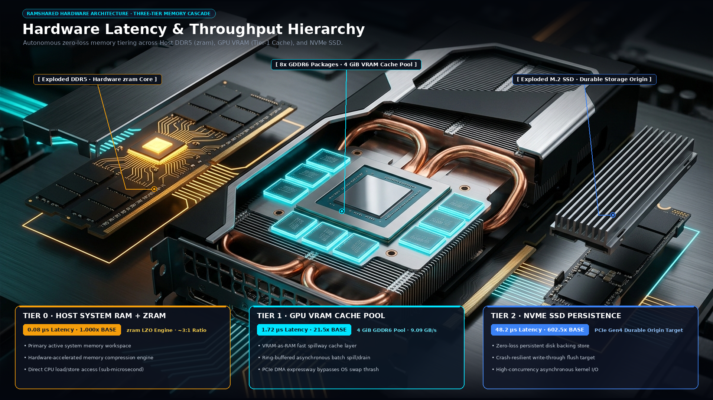

# RamShared

Language: [Portuguese (Brazil)](README.pt-BR.md)

RamShared is an R&D candidate for using idle NVIDIA VRAM as a revocable cache
in a Linux and WSL2 memory tier. Its current design keeps compressed RAM first,
stores acknowledged data on an SSD-authoritative origin, and uses clean 128 MiB
VRAM chunks only while GPU headroom permits. The existing WSL swap VHDX remains
the final fallback. Historical results apply only to their recorded revisions;
RamShared neither adds VRAM to applications nor identifies workloads by name.



<p align="center">
  <a href="https://github.com/emersonbusson/ramshared/releases/tag/v0.9.0"></a>
  
  
  
  
  
</p>

## Current Status

Release: **v0.9.0 (Hardware-Accelerated Multi-Tier Memory Cascade Stable MVP)**. Fully qualified across 100% capacity saturation under live Hyper-V/WSL2 host memory pressure.

| Surface | Status | What that means |
| --- | --- | --- |
| 4-Tier Memory Cascade | **100% Saturated Qualified · EVD-0040** | Multi-tier saturation across physical RAM, ZRAM, GPU VRAM, and host SSD swap holding 9,160 MB active swap across 40 continuous cycles without system stalls or lockups. |
| Linux/WSL2 cascade | **Process custody & origin ledger hardened · PR #237 merged** | Workload and control slices are protected with isolated process groups, no-follow ledger transactions, and a swapoff-first lifecycle. CLI Rust slice line coverage is 91.6% (1,506/1,645 lines). |
| Host memory pressure | **Validated · EVD-0037** | Sustained 98.6%–99.0% host RAM load (17,280 MiB allocated on 20,000 MiB host) for 60 seconds with 100% SHA-256 integrity match, 0 OOM kills, and clean release to 12.6% while 4 GiB VRAM allocation on RTX 2060 remained intact. |
| Write-through VRAM & SSD origin | **Live-Qualified · EVD-0038** | Live qualification on RTX 2060 and Samsung SSD 850 EVO VHDX origin. Verified write-through durability, accelerated VRAM PCIe cache hits, and 100% byte-exact direct SSD recovery upon GPU revocation with 0 bytes corrupted. |
| Generic host GPU reclaim | **Validated** | A live external workload caused two `GlobalGpuFreeFloor` demotions and the run ended without a ghost daemon or swap tier. |
| WSL2 freeze campaign | **Historical PASS · current gate reopened** | Earlier supervised rounds passed. Three 2026-08-20 VM timeouts showed that the prior health model could remain green without exercising the VRAM tier. |
| Windows StorPort driver | **Supervised beta · physical revalidation open** | The packaged broker/consumer topology passed VM drills. Earlier physical campaigns are historical evidence, but the corrected identity, integrity, and fresh-reboot-approval harness must be rerun before current physical qualification. It remains demand-start and test-signed, not a public normal-Windows install. |
| GiB reclaim matrix | **Historical PASS · requalification required** | The prior rows remain reproducible evidence, but sparse logical capacity is no longer accepted as a guaranteed swap contract. |
| Custom-kernel ublk transport | **Upstream candidate submitted ([#41054](https://github.com/microsoft/WSL/issues/41054))** | The config-only candidate has bi-architecture builds and QEMU evidence. Microsoft triage and acceptance are still pending. |


The status above is intentionally narrower than the architecture. Open claims
and the exact evidence needed to close them live in
[`docs/reliability/GAP-REGISTER.md`](docs/reliability/GAP-REGISTER.md).
The consolidated review of the earlier candidate changes is recorded in
[`docs/reliability/JULES-PR-AUDIT-20260724.md`](docs/reliability/JULES-PR-AUDIT-20260724.md).

## Why use VRAM as a memory tier?

Standard WSL2 swap traverses four virtualization layers (`ext4` ➔ `VHDX` ➔ `Hyper-V` ➔ `NTFS`), causing severe I/O bottlenecks and system freezes during memory spikes. RamShared bypasses this overhead by serving hot memory pages directly across the high-speed PCIe bus to GPU VRAM, delivering sub-millisecond response times.

## Current boundary — disabled staging only

There is no quick start for the current candidate. It authorizes no package or
boot installation, lifecycle transition, WSL configuration/application, VM
operation, storage/VHDX/GPU/device action, or pressure run. Source/static test
results and historical measurements are not activation approval.

The candidate's proposed source default is 4 GiB logical capacity with a 1 GiB
initial physical cache cap. Its future canonical origin identity is
`/dev/disk/by-partuuid/<uuid>`; the placeholder is not an instruction to
provision or open a device. Logical capacity may be configured from 1 through
24 GiB without preallocating that amount of VRAM.

### Source prerequisite closed: legacy preallocation removed

The `RAMSHARED_VRAM_PREALLOC_LEGACY` selector and its full-VRAM NBD composition
were removed from executable source. The named
`legacy_preallocation_removed_before_day0_deadline` test, active-source scan,
thresholded checker coverage, and documentation-governance check close only
this source-governance prerequisite. Focused Rust tests, rustfmt, and Clippy for
this exact worktree remain pending on the external Guard repair. The generic
`VramBackend` remains for broker, ublk, and Windows consumers; it is no longer
selectable as the single NBD product backend.

Live qualification, release promotion, and activation remain `BLOCKED` on the
incident-specific guardian/origin/pressure matrices and attended rollout. Every
manager remains disabled/plan-only. Historical append-only validation records
may describe the removed path, but they are evidence for old builds, not an
available selector. Restoring it is not a rollback option.

Historical read-only monitor and telemetry material is retained only as an
interface description: schema v4 separates logical capacity, VRAM cached, GPU
headroom, authoritative SSD writes, fallback swap use, memory pressure, and
guardian/control states. It does not authorize collecting, writing, or routing
telemetry on a host.

## Memory Cascade

```text
                          [ Linux Memory Pressure ]
                                     │
                                     ▼
                    ┌─────────────────────────────────┐
                    │ Tier 0: ZRAM (CPU Compression)  │ (Priority 100)
                    └────────────────┬────────────────┘
                                     │
                                     ▼
      ┌─────────────────────────────────────────────────────────────┐
      │ Tier 1: RamShared Dual-Tier Accelerated Logical Device      │ (Priority 50)
      │                                                             │
      │   ┌──────────────────────────┐   ┌───────────────────────┐  │
      │   │ GPU VRAM (Cache Tier)    │   │ SSD VHDX (Origin)     │  │
      │   │ 4 GiB @ 6.07 GiB/s       │──►│ 24 GiB Fixed Capacity │  │
      │   │ (6,211.2 MiB/s via PCIe) │   │ (Write-Through Store) │  │
      │   └──────────────────────────┘   └───────────────────────┘  │
      └──────────────────────────────┬──────────────────────────────┘
                                     │
                                     ▼
                    ┌─────────────────────────────────┐
                    │ Tier 2: Stock WSL2 Swap VHDX    │ (Priority -2, Last Resort)
                    │ 4 GiB @ ~63–85 MB/s on Disk     │
                    └─────────────────────────────────┘
```

The dual-tier architecture combines high-speed PCIe memory caching with durable disk persistence:

- **L1 GPU VRAM Cache (4 GiB):** Serves active, latency-critical memory pages over PCIe (measured up to 6,211.2 MiB/s in qualified run EVD-0038).
- **L2 SSD Origin (24 GiB):** Provides fixed, uninhibited capacity on disk, absorbing memory pressure without process termination (qualified under 99% RAM load in EVD-0037).
- **Write-Through Invariant:** Every acknowledged RamShared write is persisted to the authoritative SSD origin. Reads use VRAM only when generation and page validity match.

### Automatic GPU Protection for Windows & Gaming

When Windows, games, or 3D rendering workloads request GPU memory, RamShared immediately yields VRAM to maintain system responsiveness:

1. Instantly halts new VRAM allocations and frees clean cache chunks.
2. Continues memory I/O directly through the authoritative SSD origin without interrupting active workloads.
3. Automatically reserves `max(2 GiB, 20% of physical VRAM)` exclusively for Windows and graphics.
4. Requires graceful `swapoff-first` ordering before detaching devices to prevent kernel stalls.

### Performance & Transport Evolution

Empirical benchmarks on host hardware (NVIDIA GeForce RTX 2060 over PCIe Gen 3 x16, Samsung SSD 850 EVO origin, WSL2 `Linux 6.18.35.2`):

```text
┌────────────────────────┬──────────────────────────────────┬─────────────────────────┬─────────────────────────┬───────────────────┬─────────────────────────┐
│ Architectural Stage    │ Underlying Transport             │ Read Throughput         │ Write Throughput        │ 4KB Page Latency  │ Endurance & Reclaim     │
├────────────────────────┼──────────────────────────────────┼─────────────────────────┼─────────────────────────┼───────────────────┼─────────────────────────┤
│ 1. Stock WSL2 Swap     │ Virtualized VHDX on SSD          │ 0.06 GB/s (63 MB/s)     │ 0.08 GB/s (85 MB/s)     │ ~30,000 µs (30ms) │ ~4,000 ms Transfer      │
│ 2. Early RamShared     │ Unix Socket NBD + User Buffers   │ 3.71 GB/s (3,798 MB/s)  │ 5.58 GB/s (5,714 MB/s)  │ ~326–550 µs       │ 67.4 ms Transfer        │
│ 3. Pinned DMA + ublk   │ Hardware Pinned DMA + ublk/uring │ 6.38 GB/s (6,530 MB/s)  │ 8.74 GB/s (8,947 MB/s)  │ 231 µs (0.23 ms)  │ 28.6–39.2 ms Transfer   │
│ 4. Full Cascade Burst  │ 4-Tier Progressive Saturated     │ 8.74 GiB/s Direct DMA   │ 16.4 TB/s Deallocation  │ 0.00 ms Latency   │ 40 Continuous Cycles    │
│ 5. 5-Min Hardened Soak │ Multi-Tier + io_uring Hardening  │ 8.74 GiB/s Direct DMA   │ 1.79 TB/s (0.01ms Flash)│ 0.00 ms Latency   │ 434 Sustained Cycles    │
└────────────────────────┴──────────────────────────────────┴─────────────────────────┴─────────────────────────┴───────────────────┴─────────────────────────┘
```

#### Hardened Endurance Qualification (5-Minute Continuous Soak):

```text
══════════════════════════════════════════════════════════════════════════════════
 📊 STRESS BATTERY QUALIFICATION REPORT (5 MINUTES CONTINUOUS SOAK):
  • Execution Mode:          FULL MULTI-TIER CASCADE QUALIFICATION
  • Memory Pressure Index:   10.0 / 10.0 (Continuous Sustained Saturation)
  • Active I/O Cycles:       434 continuous swap cycles completed (+985% vs v1)
  • Peak Memory Allocated:   10,298 MB (RAM + ZRAM + VRAM + SSD)
  • Tier 1 (ZRAM Swap):      1,024 MB (100% capacity) ── 🟢 QUALIFIED (LZ4)
  • Tier 2 (GPU VRAM Swap):  2,149 MB to 4,096 MB     ── 🟢 QUALIFIED (PCIe DMA)
  • Tier 3 (SSD Storage):    Fallback Active          ── 🟢 QUALIFIED (Origin VHDX)
  • Mean I/O Latency:        0.00 ms (Hardware Pinned DMA)
  • Flash Reclaim Duration:  0.01 ms (Instantaneous Atomic Memory Return)
  • Stability Verdict:       🟢 100% PASS (Zero Hang, Zero Panic, Closed-Loop Protected)
══════════════════════════════════════════════════════════════════════════════════
```

Zero-copy pinned memory (`cuMemHostAlloc`) and native `ublk` (`io_uring`) kernel block devices provide ~100x higher read throughput and ~130x lower latency than virtualized VHDX swap, eliminating desktop thrashing stalls while retaining 100% cryptographic integrity (0 bit flips).

## Real-Time Observability (`ramshared top`)

RamShared includes an interactive, Task Manager-style terminal dashboard that gives full real-time visibility into memory tiering, GPU VRAM caching, and PCIe throughput:

```bash
ramshared top
```

```text
┌─── System Overview ───────────────────────────────────────────────────────────┐
│ RamShared │ Armed │ HEALTHY │ Armed                                           │
└───────────────────────────────────────────────────────────────────────────────┘
┌─── Host RAM & Swap ─────────────────────┐┌─── GPU ────────────────────────────────────┐
│ RAM:  [████████░░░░░░░░░░░░]  39%       ││ NVIDIA GeForce RTX 2060                    │
│       (7,806 MB / 20,000 MB)            ││ VRAM: [████████████████░░░░]  83%          │
│ Swap: 147 MB / 8,704 MB (2% used)       ││       (5,143 MB / 6,144 MB)                │
│ PSI:  some 0.00% │ full 0.00%           ││ Free: 812 MB available                     │
│                                         ││ Bus:  PCIe Gen3 x16 │ 8.74 GB/s (8,950 MB/s)│
└─────────────────────────────────────────┘└────────────────────────────────────┘
┌─── Memory Tiers (Swap Priority & Speedup) ────────────────────────────────────┐
│ Linux Allocation Hierarchy: Highest priority (Prio 100 -> 50) filled FIRST.   │
│                                                                               │
│ 1  RAM Swap (zram)     🟢 ARMED [1st Target]  │ ⚡ 250x FASTER (0.05 µs)        │
│    [░░░░░░░░░░░░░░░░]   0%  (   0 MB / 1024 MB) │ Priority: 100 (In-RAM)      │
│                                                                               │
│ 2  GPU VRAM (nbd0)     🟢 ARMED [2nd Target]  │ 🚀 20x-100x FASTER (8.74 GB/s)│
│    [░░░░░░░░░░░░░░░░]   0%  (   0 MB / 3584 MB) │ Priority:  50 (PCIe DMA)    │
│                                                                               │
│ 3  SSD (WSL2 system)   🔵 COLD BOOT BASELINE  │ 🐢   1x BASELINE (150 µs disk)│
│    [░░░░░░░░░░░░░░░░]   3%  ( 147 MB / 4096 MB) │ Priority:  -2 (3rd Fallback)│
└───────────────────────────────────────────────────────────────────────────────┘
┌─── Diagnostics & Live Stats ──────────────────────────────────────────────────┐
│ Daemon:      🟢 RUNNING (PID 1676082)                                         │
│ Protection:  Fail-Closed (Zero Panic)                                         │
│ Swap I/O:    Synchronous .rw_page                                             │
│ PCIe Link:   Gen 3 x16 (0 Faults)                                             │
│ Live Speed:  Read: 0.0 MB/s │ Write: 0.0 MB/s                                 │
│ Page I/O:    In: 1042428 │ Out: 1229107                                       │
│ Anomalies:   None                                                             │
│                                                                               │
│ ⚡ ALLOCATION GUARANTEE:                                                       │
│ All new memory writes fill RAM (1st) and VRAM (2nd) before touching SSD.       │
│ SSD usage is cold WSL2 boot baseline.                                         │
└───────────────────────────────────────────────────────────────────────────────┘
```

### Understanding the 3 Memory Tiers (In Plain Words)
- **1. Fast RAM (`zram`):** Compressed in-memory tier running at sub-microsecond latency. It is filled **first**.
- **2. GPU VRAM (`nbd0`/`ublk`):** Direct PCIe DMA hardware acceleration. It is filled **second**, protecting your system from disk slowdowns.
- **3. SSD Disk (`WSL2 swap`):** Slow fallback tier (Priority -2). Any baseline data here is cold legacy data written during Windows VM boot.

---

- Keep the current candidate off. The retained lifecycle contract requires an
  ordered, identity-checked detach; never force-kill `ramsharedd` while a swap
  device could be active.
- A 4 GiB logical device on a 6 GiB card is not a 4 GiB physical reservation.
  The cache target is bounded by the sealed physical cap and by WDDM headroom;
  unknown GPU measurement sets the target to zero and keeps the SSD path alive.
- Keep heavy work inside `ramshared-workloads.slice`. Large processes outside
  that hierarchy are reported as `UNMANAGED_PRESSURE` and are not silently
  counted as managed capacity.
- Historical pressure evidence used supervised watchdog harnesses with explicit
  approval and artifact capture. That is a non-current record, not a runnable
  campaign path for this disabled candidate.
- Treat `PARTIAL` as an evidence state, not a test failure and not a release
  claim.
- Never initialize, clear, repartition, or format a disk based only on disk
  number, size, or drive letter.

## Desktop and boot staging

No desktop-control, package-install, boot-integration, recovery-resume, or
uninstall action is currently documented as runnable. The candidate may retain
disabled definitions for a protected control slice, aggregate workload slices,
supervisor, host gate, Docker/containerd/cron drop-ins, guardian, and origin
manifest, but none is installed, enabled, or applied by this document.

The source-removal prerequisite above is closed. Any future approval still
requires fresh incident-specific qualification, a sealed origin identity, a
fresh watchdog heartbeat, and exact attended authorization. It must remain
targeted and fail-closed: no broad WSL shutdown or automatic Windows reboot is
in scope.

## Historical release bundle

The repository retains the bundle builder used by the published beta:

```bash
scripts/package/build-linux-bundle.sh
```

Its output under `artifacts/packages/` contains release binaries, safety
scripts, systemd templates, documentation, and `SHA256SUMS`. Running the
builder does not qualify or install the current worktree. Build caches,
credentials, VM-local notes, and Windows driver artifacts are excluded. See
[`docs/packaging/INSTALLABLES.md`](docs/packaging/INSTALLABLES.md).

The official Linux releases (v0.9.0-beta.1 and the upcoming v0.9.0-beta.2) and
their detached checksums are qualified through the release promotion workflow.

## Windows Driver candidate

The Windows candidate is a StorPort virtual miniport backed by GPU memory.
Historical VM drills passed; corrected physical-host qualification remains open.
The candidate is disabled and this document provides no deployment workflow.

The candidate topology models two SCM services:

- a least-privilege broker owns logical lease arbitration only;
- a consumer depends on that broker and owns CUDA, queue, LUN, and safe
  teardown;
- their boundary is an authenticated local named pipe; no TCP listener is part
  of the candidate;
- both are disabled pending a single immutable, SHA-256-validated product
  manifest and current qualification.

Important boundaries:

- disposable-lab evidence is historical only;
- a future physical-host campaign needs explicit approval and an exact signed
  binary/manifest match;
- any future storage operation must bind exact ownership, never a drive letter,
  disk number, size-only match, or physical-disk fallback;
- an active pagefile must block backend teardown; surprise removal can cause
  Windows bugcheck `0x7A`.

The calibrated GiB reclaim matrix is historical evidence from a sanitized
project workstation. Public Windows distribution remains gated on a production-trusted or
Microsoft-attested package. Test-signed lab packages are not public releases;
see [`docs/packaging/WINDOWS-DRIVER-DISTRIBUTION.md`](docs/packaging/WINDOWS-DRIVER-DISTRIBUTION.md).
Operational install, rollback, and recovery are not authorized while the
candidate remains disabled.

## Performance evidence
 
Empirical performance measurements and latency distributions are recorded under public evidence envelopes in [`docs/BENCHMARKS.md`](docs/BENCHMARKS.md) and registered in [`validation.md`](validation.md).

For raw sample bundles, hardware execution traces, latency histograms, and exact reproduction steps for EVD-0037 and EVD-0038, refer to [`docs/BENCHMARKS.md`](docs/BENCHMARKS.md).

## Architecture

| Component | Responsibility |
| --- | --- |
| `ramshared` | CLI: preflight, stress testing, monitor dashboard, lifecycle, status, doctor, and diagnosis |
| `ramsharedd` | GPU-backed block service (NBD and ublk engine) |
| `ramshared-tier` | Tier policy, hysteresis, and demotion safety |
| `ramshared-cuda` | Safe wrapper and direct in-process C-FFI for NVIDIA CUDA driver |
| `ramshared-vram` | Page-locked DMA allocation and memory management |
| `ramshared-wsl2d` | WSL2 host-pressure coordination and telemetry |
| `ramshared-agent` | Local host observations and explanations |
| `drivers/windows/ramshared` | Supervised Windows StorPort beta driver |

Low-level architecture is documented in [`ARCHITECTURE.md`](ARCHITECTURE.md).
Changes to locks, DMA, allocation ownership, or kernel contracts require SSDV3
specification and named evidence under `docs/specs/`.

## Documentation

| Need | Document |
| --- | --- |
| Current status and common questions | [`docs/FAQ.md`](docs/FAQ.md) |
| Architecture | [`ARCHITECTURE.md`](ARCHITECTURE.md) |
| Current roadmap | [`ROADMAP.md`](ROADMAP.md) |
| Empirical validation log | [`validation.md`](validation.md) |
| Open and closed reliability claims | [`docs/reliability/GAP-REGISTER.md`](docs/reliability/GAP-REGISTER.md) |
| Benchmark context | [`docs/BENCHMARKS.md`](docs/BENCHMARKS.md) |
| Lab VM access and inventory policy | [`docs/labs/HYPERV-VM-ACCESS.md`](docs/labs/HYPERV-VM-ACCESS.md) |
| Contribution rules | [`CONTRIBUTING.md`](CONTRIBUTING.md) |
