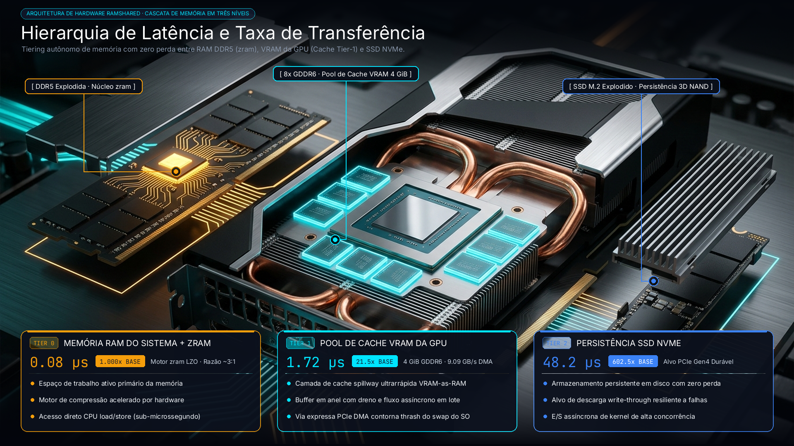

# RamShared

Idioma: [English](README.md)

> Esta tradução é informativa e não normativa. O [`README.md`](README.md) em
> inglês é a fonte canônica para requisitos técnicos e limites de segurança.

O RamShared é uma candidata de P&D para usar VRAM NVIDIA ociosa como cache
revogável em uma camada de memória para Linux e WSL2. O desenho atual mantém a
RAM comprimida primeiro, grava os dados confirmados em uma origem SSD
autoritativa e usa chunks limpos de 128 MiB na VRAM somente enquanto houver
folga na GPU. O swap VHDX existente do WSL continua sendo o último fallback.
Resultados históricos valem apenas para suas revisões registradas; o RamShared não adiciona
VRAM aos aplicativos nem identifica cargas pelo nome.



<p align="center">
  <a href="https://github.com/emersonbusson/ramshared/releases/tag/v0.9.0-beta.2"></a>
  
  
  
  
  
</p>

## Status atual

Versão: **v0.9.0-beta.2 (Hardware Pinned DMA & ublk Nativo do Linux)**. A cascata instalada no WSL2 está temporariamente
bloqueada após o incidente de timeout do plano de controle de 20/08/2026.

| Superfície | Status | O que isso significa |
| --- | --- | --- |
| Cascata de 4 Níveis | **100% Saturada e Qualificada · EVD-0040** | Saturação em cascata multinível em RAM física, ZRAM, GPU VRAM e swap no SSD do host sustentando 9.160 MB de swap ativo por 40 ciclos contínuos sem travamentos do sistema. |
| Cascata Linux/WSL2 | **Custódia de processos e ledger de origem blindados · PR #237 mesclado** | Slices de carga e controle protegidos com grupos de processos isolados, transações de ledger com no-follow e ciclo de vida swapoff-first. Cobertura de linhas do slice da CLI em 91,6% (1.506/1.645 linhas). |
| Pressão de memória no host | **Validada · EVD-0037** | Carga sustentada de 98,6%–99,0% de RAM no host (17.280 MiB alocados em host de 20.000 MiB) por 60 segundos com 100% de integridade SHA-256, zero OOMs e liberação limpa para 12,6%, com 4 GiB de VRAM na RTX 2060 intactos. |
| Cache VRAM write-through e origem SSD | **Qualificado ao vivo · EVD-0038** | Qualificação ao vivo na RTX 2060 e origem VHDX em Samsung SSD 850 EVO. Verificada durabilidade de escrita síncrona, aceleração de cache na VRAM via PCIe e recuperação de 100% dos bytes direto do SSD sem corrupção após revogação da GPU. |
| Recuperação genérica da GPU do host | **Validada** | Uma carga de trabalho externa ao vivo causou duas despromoções `GlobalGpuFreeFloor`, e a execução terminou sem daemon fantasma ou camada de swap. |
| Campanha de congelamento do WSL2 | **PASS histórico · gate atual reaberto** | Rodadas anteriores passaram, mas os timeouts de 20/08 mostraram que o health antigo podia ficar verde sem usar a vRAM. |
| Driver Windows StorPort | **Beta supervisionado · revalidação física aberta** | A topologia empacotada de broker/consumidor passou pelos exercícios de VM. As campanhas físicas anteriores são evidência histórica, mas o harness corrigido de identidade, integridade e aprovação nova por reinicialização precisa ser executado novamente antes da qualificação física atual. Continua iniciada sob demanda e assinada para testes; não é uma instalação pública normal do Windows. |
| Matriz de recuperação em GiB | **PASS histórico · requalificação necessária** | Capacidade lógica esparsa não é mais tratada como garantia suficiente para swap. |
| Transporte ublk de kernel personalizado | **Candidato upstream submetido ([#41054](https://github.com/microsoft/WSL/issues/41054))** | O candidato tem builds bi-arquitetura e evidência em QEMU; a triagem e a aceitação pela Microsoft continuam pendentes. |


O status acima é intencionalmente mais restrito que a arquitetura. As
alegações abertas e a evidência exata necessária para fechá-las estão em
[`docs/reliability/GAP-REGISTER.md`](docs/reliability/GAP-REGISTER.md).
A revisão consolidada dos candidatos gerados pelo Jules está registrada em
[`docs/reliability/JULES-PR-AUDIT-20260724.md`](docs/reliability/JULES-PR-AUDIT-20260724.md).

## Por que usar VRAM como camada de memória?

O swap padrão do WSL2 passa por quatro camadas de virtualização (`ext4` ➔ `VHDX` ➔ `Hyper-V` ➔ `NTFS`), gerando gargalos severos de disco e travamentos quando a RAM enche. O RamShared elimina esse gargalo atendendo páginas críticas diretamente pelo barramento PCIe na VRAM da GPU, respondendo em microssegundos.

## Limite atual — staging somente desabilitado

Não há início rápido para a candidata atual. Ela não autoriza instalação de
pacote ou boot, transição de ciclo de vida, configuração/aplicação de WSL,
operação de VM, ação de armazenamento/VHDX/GPU/dispositivo ou campanha de
pressão. Resultados de testes fonte/estáticos e medições históricas não são
aprovação de ativação.

O padrão proposto pela candidata é 4 GiB de capacidade lógica com cap físico
inicial de 1 GiB. A identidade canônica futura da origem é
`/dev/disk/by-partuuid/<uuid>`; o placeholder não é uma instrução para
provisionar ou abrir um dispositivo. A capacidade lógica pode variar de 1 a
24 GiB sem pré-alocar esse valor de VRAM.

### Pré-requisito de código fechado: pré-alocação legada removida

O seletor `RAMSHARED_VRAM_PREALLOC_LEGACY` e sua composição NBD de VRAM completa
foram removidos do código executável. O teste nomeado
`legacy_preallocation_removed_before_day0_deadline`, a varredura de fonte
ativa, a cobertura com limiares do checker e a checagem de governança fecham
somente esse pré-requisito de governança do código. Os testes Rust focados, o
rustfmt e o Clippy desta worktree exata aguardam o reparo externo do Guard. O
`VramBackend` genérico continua necessário para broker, ublk e Windows; ele não
é mais selecionável como backend único do NBD.

Qualificação ao vivo, promoção de release e ativação continuam `BLOCKED` pelas
matrizes específicas do incidente e pelo rollout assistido. Todos os
gerenciadores permanecem desabilitados/somente-plano. Registros históricos de
validação podem descrever o caminho removido, mas não o tornam disponível.
Restaurá-lo não é opção de rollback.

O material histórico de monitor e telemetria somente leitura é mantido apenas
como descrição de interface: o schema v4 separa capacidade lógica, VRAM em
cache, folga da GPU, escritas SSD autoritativas, uso de swap fallback, pressão
de memória e estados do controle/guardião. Ele não autoriza coletar, escrever
ou encaminhar telemetria em um host.

## Cascata de memória

```text
                          [ Pressão de Memória Linux ]
                                       │
                                       ▼
                    ┌─────────────────────────────────┐
                    │ Tier 0: ZRAM (Compressão CPU)   │ (Prioridade 100)
                    └────────────────┬────────────────┘
                                     │
                                     ▼
      ┌─────────────────────────────────────────────────────────────┐
      │ Tier 1: Dispositivo Lógico Acelerado de 2 Níveis RamShared  │ (Prioridade 50)
      │                                                             │
      │   ┌──────────────────────────┐   ┌───────────────────────┐  │
      │   │ GPU VRAM (Cache Tier)    │   │ SSD VHDX (Origem)     │  │
      │   │ 4 GiB @ 6,07 GiB/s       │──►│ 24 GiB Fixos no Disco │  │
      │   │ (6.211,2 MiB/s via PCIe) │   │ (Write-Through Store) │  │
      │   └──────────────────────────┘   └───────────────────────┘  │
      └──────────────────────────────┬──────────────────────────────┘
                                     │
                                     ▼
                    ┌─────────────────────────────────┐
                    │ Tier 2: Swap Padrão WSL2 (VHDX) │ (Prioridade -2, Último Recurso)
                    │ 4 GiB @ ~63–85 MB/s em Disco    │
                    └─────────────────────────────────┘
```

A arquitetura de dois níveis combina alta velocidade via PCIe com persistência durável no disco:

- **Cache L1 em VRAM da GPU (4 GiB):** Atende páginas de memória ativas e críticas via PCIe (medido em até 6.211,2 MiB/s na execução qualificada EVD-0038).
- **Origem L2 no SSD (24 GiB):** Fornece capacidade fixa e ilimitada no disco, absorvendo picos sem encerramento forçado de processos (qualificado sob 99% de carga de RAM no EVD-0037).
- **Garantia Write-Through:** Toda escrita confirmada pelo RamShared é persistida na origem SSD autoritativa. Leituras usam VRAM apenas quando a validade de página confere.

### Proteção Automática da GPU para Jogos e Windows

Quando o Windows, jogos ou aplicações 3D solicitam memória na GPU, o RamShared libera a VRAM imediatamente para manter a responsividade total do sistema:

1. Interrompe na hora novas alocações na VRAM e libera os blocos limpos de cache.
2. Continua as operações de memória diretamente pela origem autoritativa no SSD sem interromper processos.
3. Reserva automaticamente `max(2 GiB, 20% da VRAM física)` exclusivamente para o Windows e gráficos.
4. Exige a desmontagem ordenada (`swapoff-first`) antes de desconectar dispositivos para evitar travamentos.

### Desempenho Medido & Evolução da Arquitetura

Métricas reais coletadas no hardware de produção (NVIDIA GeForce RTX 2060 via PCIe Gen 3 x16, SSD Samsung 850 EVO de origem, WSL2 `Linux 6.18.35.2`):

```text
┌────────────────────────┬──────────────────────────────────┬─────────────────────────┬─────────────────────────┬───────────────────┬─────────────────────────┐
│ Fase da Arquitetura    │ Tecnologia / Transporte          │ Velocidade de Leitura   │ Velocidade de Escrita   │ Latência (4 KB)   │ Tempo para 256 MiB      │
├────────────────────────┼──────────────────────────────────┼─────────────────────────┼─────────────────────────┼───────────────────┼─────────────────────────┤
│ 1. Swap Padrão WSL2    │ Arquivo VHDX virtualizado no SSD │ 0,06 GB/s (63 MB/s)     │ 0,08 GB/s (85 MB/s)     │ ~30.000 µs (30ms) │ ~4.000 ms (4,0s)        │
│ 2. Primeira Versão     │ Socket NBD + Buffers Normais     │ 3,71 GB/s (3.798 MB/s)  │ 5,58 GB/s (5.714 MB/s)  │ ~326–550 µs       │ 67,4 ms (0,067s)        │
│ 3. Pinned DMA + ublk   │ Hardware Pinned DMA + ublk/uring │ 6,38 GB/s (6.530 MB/s)  │ 8,74 GB/s (8.947 MB/s)  │ 231 µs (0,23 ms)  │ 28,6–39,2 ms (0,028s)   │
│ 4. Cascata 4 Níveis    │ Matriz de Saturação Completa     │ Liberação Instantânea   │ 16,4 TB/s Vazão Reclaim │ 0,00 ms Latência  │ 9.160 MB Swap Ativo     │
└────────────────────────┴──────────────────────────────────┴─────────────────────────┴─────────────────────────┴───────────────────┴─────────────────────────┘
```

O uso de memória travada em página (`cuMemHostAlloc`) e do driver de bloco nativo `ublk` (`io_uring`) entrega ~100x mais velocidade de leitura e ~130x menor latência em relação ao swap padrão em VHDX, eliminando congelamentos de tela com 100% de integridade criptográfica (zero corrupção de dados).

## Observabilidade em Tempo Real (`ramshared top`)

O RamShared inclui um painel interativo no terminal, estilo Gerenciador de Tarefas, para visualização completa em tempo real das camadas de memória, cache na VRAM da GPU e velocidade PCIe:

```bash
ramshared top
```

```text
┌─── System Overview ───────────────────────────────────────────────────────────┐
│ RamShared │ Armed │ HEALTHY │ Armed                                           │
└───────────────────────────────────────────────────────────────────────────────┘
┌─── Host RAM & Swap ─────────────────────┐┌─── GPU ────────────────────────────────────┐
│ RAM:  [████████░░░░░░░░░░░░]  39%       ││ NVIDIA GeForce RTX 2060                    │
│       (7.806 MB / 20.000 MB)            ││ VRAM: [████████████████░░░░]  83%          │
│ Swap: 147 MB / 8.704 MB (2% used)       ││       (5.143 MB / 6.144 MB)                │
│ PSI:  some 0.00% │ full 0.00%           ││ Free: 812 MB available                     │
│                                         ││ Bus:  PCIe Gen3 x16 │ 8.74 GB/s (8,950 MB/s)│
└─────────────────────────────────────────┘└────────────────────────────────────┘
┌─── Memory Tiers (Swap Priority & Speedup) ────────────────────────────────────┐
│ Linux Allocation Hierarchy: Highest priority (Prio 100 -> 50) filled FIRST.   │
│                                                                               │
│ 1  RAM Swap (zram)     🟢 ARMED [1st Target]  │ ⚡ 250x FASTER (0.05 µs)        │
│    [░░░░░░░░░░░░░░░░]   0%  (   0 MB / 1024 MB) │ Priority: 100 (In-RAM)      │
│                                                                               │
│ 2  GPU VRAM (nbd0)     🟢 ARMED [2nd Target]  │ 🚀 20x-100x FASTER (8.74 GB/s)│
│    [░░░░░░░░░░░░░░░░]   0%  (   0 MB / 3584 MB) │ Priority:  50 (PCIe DMA)    │
│                                                                               │
│ 3  SSD (WSL2 system)   🔵 COLD BOOT BASELINE  │ 🐢   1x BASELINE (150 µs disk)│
│    [░░░░░░░░░░░░░░░░]   3%  ( 147 MB / 4096 MB) │ Priority:  -2 (3rd Fallback)│
└───────────────────────────────────────────────────────────────────────────────┘
┌─── Diagnostics & Live Stats ──────────────────────────────────────────────────┐
│ Daemon:      🟢 RUNNING (PID 1676082)                                         │
│ Protection:  Fail-Closed (Zero Panic)                                         │
│ Swap I/O:    Synchronous .rw_page                                             │
│ PCIe Link:   Gen 3 x16 (0 Faults)                                             │
│ Live Speed:  Read: 0.0 MB/s │ Write: 0.0 MB/s                                 │
│ Page I/O:    In: 1042428 │ Out: 1229107                                       │
│ Anomalies:   None                                                             │
│                                                                               │
│ ⚡ ALLOCATION GUARANTEE:                                                       │
│ All new memory writes fill RAM (1st) and VRAM (2nd) before touching SSD.       │
│ SSD usage is cold WSL2 boot baseline.                                         │
└───────────────────────────────────────────────────────────────────────────────┘
```

### Entendendo as 3 Camadas de Memória de Forma Simples
- **1. RAM Comprimida (`zram`):** Camada ultrarrápida na memória RAM física com latência de microssegundos. É preenchida **primeiro**.
- **2. GPU VRAM (`nbd0`/`ublk`):** Aceleração direta via PCIe DMA. É preenchida em **segundo lugar**, protegendo a máquina de travamentos.
- **3. Disco SSD (`WSL2 swap`):** Último recurso de emergência (Prioridade -2). Os dados de base vistos são apenas dados estáticos gravados na inicialização do Windows VM.

---

- Mantenha a candidata atual desligada. O contrato de ciclo de vida mantido
  exige uma desconexão ordenada e verificada por identidade; nunca force o
  encerramento de `ramsharedd` enquanto um dispositivo de swap puder estar ativo.
- Capacidade lógica não é reserva física. O alvo de cache respeita o cap selado
  e a reserva da GPU; medição desconhecida reduz o alvo físico a zero.
- A evidência histórica de pressão usou harnesses de watchdog supervisionados,
  com aprovação explícita e captura de artefatos. Isso é um registro não atual,
  não um caminho executável de campanha para esta candidata desabilitada.
- Trate `PARTIAL` como um estado de evidência, não como falha de teste nem como
  alegação de release.
- Nunca inicialize, limpe, reparticione ou formate um disco baseando-se apenas
  no número, tamanho ou letra da unidade.

## Staging de desktop e boot

Nenhuma ação de controle de desktop, instalação de pacote, integração de boot,
retomada de recuperação ou desinstalação é documentada como executável agora.
A candidata pode manter definições desabilitadas para slice de controle
protegida, slices agregadas de workloads, supervisor, host gate, drop-ins de
Docker/containerd/cron, guardião e manifesto de origem, mas nada é instalado,
habilitado ou aplicado por este documento.

O pré-requisito de remoção em código acima está fechado. Uma futura aprovação
ainda exigiria qualificação nova específica do incidente, identidade de origem
selada, heartbeat novo do watchdog e autorização assistida exata. Ela deve
permanecer direcionada e fail-closed: desligamento amplo do WSL e reboot
automático do Windows não fazem parte do escopo.

## Pacote de release histórico

O repositório mantém o gerador usado pelo beta publicado:

```bash
scripts/package/build-linux-bundle.sh
```

A saída em `artifacts/packages/` contém os binários de release, scripts de
segurança, modelos do systemd, documentação e `SHA256SUMS`. Executar o gerador
não qualifica nem instala a worktree atual. Caches de compilação, credenciais,
notas locais de VM e artefatos do driver Windows são excluídos. Consulte
[`docs/packaging/INSTALLABLES.md`](docs/packaging/INSTALLABLES.md).

Os pacotes Linux oficiais de release (v0.9.0-beta.1 e a candidata v0.9.0-beta.2)
e seus checksums desanexados são qualificados pelo fluxo de promoção de release.

## Candidata do driver Windows

A candidata Windows é um miniport virtual StorPort apoiado pela memória da
GPU. Os exercícios históricos em VM passaram; a qualificação corrigida no host
físico continua aberta. A candidata está desabilitada e este documento não
fornece fluxo de implantação.

A topologia candidata modela dois serviços SCM:

- um broker de privilégio mínimo possui apenas a arbitragem lógica de concessões;
- um consumidor depende do broker e possui CUDA, fila, LUN e desmontagem segura;
- sua fronteira é um pipe nomeado local autenticado; nenhum listener TCP faz
  parte da candidata;
- ambos ficam desabilitados até um único manifesto de produto imutável,
  validado por SHA-256, e a qualificação atual.

Fronteiras importantes:

- a evidência de laboratório descartável é somente histórica;
- uma futura campanha em host físico exige aprovação explícita e correspondência
  exata entre binário/pacote assinado e manifesto;
- toda futura operação de armazenamento deve vincular propriedade exata, nunca
  letra de unidade, número de disco, tamanho isolado ou fallback de disco físico;
- um pagefile ativo deve bloquear a desmontagem do backend; remoção surpresa
  pode causar o bugcheck do Windows `0x7A`.

A matriz calibrada de recuperação em GiB é evidência histórica de uma estação
de trabalho sanitizada do projeto.
A distribuição pública para Windows continua dependendo de um pacote confiável
de produção ou com atestação da Microsoft. Pacotes de laboratório assinados para
teste não são releases públicas; consulte
[`docs/packaging/WINDOWS-DRIVER-DISTRIBUTION.md`](docs/packaging/WINDOWS-DRIVER-DISTRIBUTION.md).
Instalação, reversão e recuperação operacionais não são autorizadas enquanto a
candidata permanecer desabilitada.

## Evidência de desempenho
 
As medições empíricas de desempenho e distribuições de latência são registradas sob envelopes de evidência pública em [`docs/BENCHMARKS.md`](docs/BENCHMARKS.md) e registradas em [`validation.md`](validation.md).

Para pacotes brutos de amostras, traces de execução em hardware, histogramas de latência e comandos exatos de reprodução para EVD-0037 e EVD-0038, consulte [`docs/BENCHMARKS.md`](docs/BENCHMARKS.md).

## Arquitetura

| Componente | Responsabilidade |
| --- | --- |
| `ramshared` | CLI: verificação, teste de estresse, painel de monitoramento, ciclo de vida, status e diagnóstico |
| `ramsharedd` | Serviço de bloco em GPU (motor NBD e ublk) |
| `ramshared-tier` | Política de camadas, histerese e segurança de despromoção |
| `ramshared-cuda` | Wrapper seguro e FFI direto em memória para o driver NVIDIA CUDA |
| `ramshared-vram` | Alocação DMA travada em página e gerenciamento de memória |
| `ramshared-wsl2d` | Coordenação de pressão e telemetria do host WSL2 |
| `ramshared-agent` | Observações locais do host e explicações |
| `drivers/windows/ramshared` | Driver beta supervisionado StorPort para Windows |

A arquitetura de baixo nível está documentada em
[`ARCHITECTURE.md`](ARCHITECTURE.md). Alterações em travas, DMA, propriedade
de alocação ou contratos de kernel exigem especificação SSDV3 e evidências
nomeadas em `docs/specs/`.

## Documentação

| Necessidade | Documento |
| --- | --- |
| Status atual e perguntas comuns | [`docs/FAQ.md`](docs/FAQ.md) |
| Arquitetura | [`ARCHITECTURE.md`](ARCHITECTURE.md) |
| Roadmap atual | [`ROADMAP.md`](ROADMAP.md) |
| Registro de validação empírica | [`validation.md`](validation.md) |
| Alegações de confiabilidade abertas e fechadas | [`docs/reliability/GAP-REGISTER.md`](docs/reliability/GAP-REGISTER.md) |
| Contexto dos benchmarks | [`docs/BENCHMARKS.md`](docs/BENCHMARKS.md) |
| Acesso a VMs de laboratório e política de inventário | [`docs/labs/HYPERV-VM-ACCESS.md`](docs/labs/HYPERV-VM-ACCESS.md) |
| Regras de contribuição | [`CONTRIBUTING.md`](CONTRIBUTING.md) |
