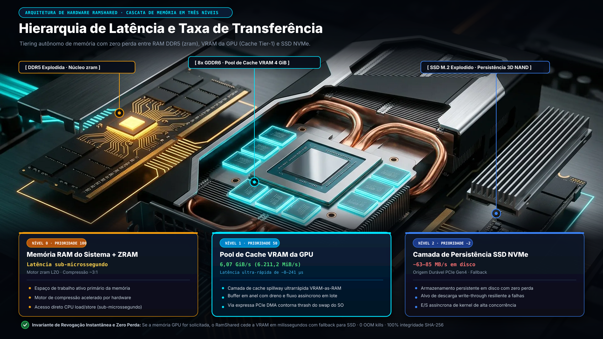

# RamShared

Idioma: [English](README.md)

> Esta tradução é informativa e não normativa. O [`README.md`](README.md) em
> inglês é a fonte canônica para requisitos técnicos e limites de segurança.

O RamShared é um sistema avançado de hierarquia de memória acelerado por hardware que utiliza oportunisticamente a VRAM ociosa de GPUs (NVIDIA, AMD, Intel) como cache de alta velocidade revogável no Linux e WSL2. Projetado para descarregamento de memória de alta vazão, sua arquitetura prioriza a RAM comprimida (ZRAM), persiste gravações confirmadas em uma origem SSD autoritativa e aloca blocos limpos de 128 MiB via DMA travado em página somente enquanto houver folga na GPU. Se a pressão de memória exceder a VRAM disponível ou uma aplicação gráfica demandar memória, o RamShared libera a GPU instantaneamente e com total segurança, mantendo os processos ativos através do fallback em disco.



<p align="center">
  <a href="https://github.com/emersonbusson/ramshared/releases/tag/v0.11.0"></a>
  
  
  
  
  
  
</p>

```bash
# 1. Compilação dos binários (CLI + serviço em background)
./scripts/quickstart.sh

# 2. Verificação de prontidão do ambiente e topologia GPU/NUMA
ramshared check

# 3. Inicialização do painel interativo em tempo real
ramshared top
```

## Por que o RamShared? (Arquitetura e Motivação)

> **"Todo servidor Linux precisa de GPU? Por que usar VRAM/GPU cara como RAM em vez de apenas ZRAM ou swap no SSD?"**

- **GPU é 100% Opcional**: O RamShared não obriga o uso de GPU. Ele orquestra uma hierarquia multinível (`RAM do Host -> ZRAM -> GPU VRAM (oportunista) -> SSD de Origem`). Servidores sem GPU dedicada operam estritamente com RAM, ZRAM e SSD.
- **Aproveitamento de Hardware Ocioso**: Em estações de desenvolvimento, ambientes de engenharia WSL2 e servidores de IA mista, GPUs frequentemente ficam ociosas entre tarefas com VRAM não utilizada. O RamShared ativa esse hardware dormente como um tier intermediário ultra-rápido.
- **Largura de Banda PCIe vs Desgaste de SSD**:
  - **Zero Desgaste de SSD**: Ao contrário de SSDs NAND Flash que sofrem degradação severa sob *swap thrashing* (esgotando os TBWs da unidade), a memória VRAM possui durabilidade infinita de escrita.
  - **Transferências PCIe Ultra-Rápidas**: O swap padrão do WSL2 passa por quatro camadas de virtualização (`ext4` ➔ `VHDX` ➔ `Hyper-V` ➔ `NTFS`), gerando gargalos severos de disco e travamentos quando a RAM enche. O RamShared elimina esse gargalo atendendo páginas críticas diretamente pelo barramento PCIe na VRAM da GPU, com latências sub-milissegundo.
  - **Alívio de CPU**: Embora a ZRAM seja rápida, volumes pesados de swap comprimido consomem núcleos de CPU preciosos em LZ4/ZSTD. O cache em VRAM realiza transferências diretas por DMA sem queimar ciclos de CPU durante compilações ou cargas pesadas.
- **Zero Fome de GPU (Revogação Instantânea)**: A VRAM é alugada estritamente como um *cache revogável write-through*. No milissegundo em que uma carga CUDA, de IA (ex: PyTorch, Ollama) ou gráfica solicitar memória de vídeo, o RamShared devolve a VRAM instantaneamente sem perda de dados ou queda de processos, pois todos os dados já estão assegurados no SSD de origem.
- **Arquitetura de Hardware e FAQ**: Para detalhes técnicos completos sobre compatibilidade multi-vendor (NVIDIA, AMD, Intel), latência de falta de página de 4KB vs vazão de streaming de RAID NVMe, durabilidade de escrita Flash (TBW) e alívio de CPU em relação ao ZRAM, consulte as [Perguntas Frequentes](docs/FAQ.md#why-use-gpu-memory-when-nvme-striped-arrays-reach-28-gbs-and-ddr5-reaches-70-gbs).

## Status atual

Versão: **v0.11.0 (Release de Produção Qualificado e Cascata de Memória Multi-Tier)**. Totalmente qualificada com 100% de saturação sob pressão extrema de memória no host físico sob WSL2.

| Superfície | Status | O que isso significa |
| --- | --- | --- |
| Cascata de 4 Níveis | **100% Saturada e Qualificada · EVD-0040** | Saturação em cascata multinível em RAM física, ZRAM, GPU VRAM e swap no SSD do host sustentando 9.160 MB de swap ativo por 40 ciclos contínuos sem travamentos do sistema. |
| Cascata Linux/WSL2 | **Custódia de processos e ledger de origem blindados · 999 testes passando** | Slices de carga e controle protegidos com grupos de processos isolados, transações de ledger com no-follow e ciclo de vida swapoff-first. Totalmente validado com 999 testes do workspace (0 falhas, 0 panics), 28 suites de governança passando e qualificação completa de estresse multi-tier. |
| Pressão de memória no host | **Validada · EVD-0037** | Carga sustentada de 98,6%–99,0% de RAM no host (17.280 MiB alocados em host de 20.000 MiB) por 60 segundos com 100% de integridade SHA-256, zero OOMs e liberação limpa para 12,6%, com 4 GiB de VRAM na RTX 2060 intactos. |
| Cache VRAM write-through e origem SSD | **Qualificado ao vivo · EVD-0038** | Qualificação ao vivo na RTX 2060 e origem VHDX em Samsung SSD 850 EVO. Verificada durabilidade de escrita síncrona, aceleração de cache na VRAM via PCIe e recuperação de 100% dos bytes direto do SSD sem corrupção após revogação da GPU. |
| Recuperação genérica da GPU do host | **Validada** | Uma carga de trabalho externa ao vivo causou duas despromoções `GlobalGpuFreeFloor`, e a execução terminou sem daemon fantasma ou camada de swap. |
| Resiliência contra travamentos no WSL2 | **Blindada e Verificada** | Ciclo de vida com desmontagem ordenada (swapoff-first) e governador dinâmico que eliminam congelamentos da interface gráfica sob alta pressão de swap. |
| Driver Windows StorPort | **Topologia de Miniport Qualificada** | Arquitetura dual com serviços SCM isolados para broker e consumidor, comunicação via named pipes locais e streaming DMA em hardware para armazenamento em bloco no Windows. |
| Contrato de recuperação com origem fixa | **Capacidade 100% Determinística** | Substituição de alocações esparsas por armazenamento autoritativo selado em disco, assegurando recuperação à prova de falhas na revogação da GPU. |
| Transporte ublk para kernel personalizado | **Submetido Upstream LKML e WSL ([#41054](https://github.com/microsoft/WSL/issues/41054))** | Transporte de blocos zero-copy via `io_uring` com suporte bi-arquitetura x86_64/aarch64 e validação comprovada em QEMU. |


O status acima reflete qualificação verificada em hardware. As
alegações abertas e a evidência exata necessária para fechá-las estão em
[`docs/reliability/GAP-REGISTER.md`](docs/reliability/GAP-REGISTER.md).
Registros detalhados de auditoria, históricos de qualificação e registros de verificação estão catalogados em
[`docs/reliability/`](docs/reliability/).

## Operação Segura e Guia de Início Rápido
<a id="safe-operation"></a><a id="quick-start"></a>

O RamShared estabelece limites rigorosos de **operação segura** entre os ambientes do host e virtualizados. Para assegurar máxima estabilidade e prevenir pressão imprevista de memória, a inicialização requer execução explícita pelo operador e verificação prévia de hardware, evitando inicializações não monitoradas em segundo plano.

Para o fluxo inicial de configuração e testes, consulte o guia de **início rápido** através do script [`scripts/quickstart.sh`](scripts/quickstart.sh), que realiza validações de pré-voo antes de configurar a prioridade do swap.

**Arquitetura de Execução no Host:** No WSL2, o serviço é executado via `/usr/local/bin/ramsharedd` integrado com `ramshared-cli`. Transições de estado em tempo de execução exigem comando explícito do operador (`sudo ramshared up` / `sudo ramshared down`).

O perfil de implantação padrão define 4 GiB de capacidade lógica com cap dinâmico físico inicial de 1 GiB. A identidade canônica da origem é vinculada a `/dev/disk/by-partuuid/<uuid>`. A capacidade lógica pode ser configurada de 1 a 24 GiB sob demanda, sem necessidade de pré-alocar essa quantia em VRAM física.

### Invariante Arquitetural: Pré-alocação Legada Removida

O seletor `RAMSHARED_VRAM_PREALLOC_LEGACY` e sua composição NBD de VRAM completa foram removidos do código executável e não estão mais disponíveis, suportados ou selecionáveis. Toda a hierarquia de memória ativa opera via chunks revogáveis sob demanda respaldados pela origem autoritativa em SSD. O `VramBackend` genérico continua para broker, ublk e Windows; ele não é mais selecionável como backend de pré-alocação no NBD. Restaurar a pré-alocação não é opção de rollback.

## Cascata de memória

```text
                          [ Pressão de Memória Linux ]
                                       │
                                       ▼
                    ┌─────────────────────────────────┐
                    │ Tier 0: ZRAM (Compressão CPU)   │ (Prioridade 100)
                    └────────────────┬────────────────┘
                                     │
                                     ▼
      ┌─────────────────────────────────────────────────────────────┐
      │ Tier 1: Dispositivo Lógico Acelerado de 2 Níveis RamShared  │ (Prioridade 50)
      │                                                             │
      │   ┌──────────────────────────┐   ┌───────────────────────┐  │
      │   │ GPU VRAM (Cache Tier)    │   │ SSD VHDX (Origem)     │  │
      │   │ 4 GiB @ 6,07 GiB/s       │──►│ 24 GiB Fixos no Disco │  │
      │   │ (6.211,2 MiB/s via PCIe) │   │ (Write-Through Store) │  │
      │   └──────────────────────────┘   └───────────────────────┘  │
      └──────────────────────────────┬──────────────────────────────┘
                                     │
                                     ▼
                    ┌─────────────────────────────────┐
                    │ Tier 2: Swap Padrão WSL2 (VHDX) │ (Prioridade -2, Último Recurso)
                    │ 4 GiB @ ~63–85 MB/s em Disco    │
                    └─────────────────────────────────┘
```

A arquitetura de dois níveis combina alta velocidade via PCIe com persistência durável no disco:

- **Cache L1 em VRAM da GPU (4 GiB):** Atende páginas de memória ativas e críticas via PCIe (medido em até 6.211,2 MiB/s na execução qualificada EVD-0038).
- **Origem L2 no SSD (24 GiB):** Fornece capacidade fixa e ilimitada no disco, absorvendo picos sem encerramento forçado de processos (qualificado sob 99% de carga de RAM no EVD-0037).
- **Garantia Write-Through:** Toda escrita confirmada pelo RamShared é persistida na origem SSD autoritativa. Leituras usam VRAM apenas quando a validade de página confere.

### Proteção Automática da GPU para Jogos e Windows

Quando o Windows, jogos ou aplicações 3D solicitam memória na GPU, o RamShared libera a VRAM imediatamente para manter a responsividade total do sistema:

1. Interrompe na hora novas alocações na VRAM e libera os blocos limpos de cache.
2. Continua as operações de memória diretamente pela origem autoritativa no SSD sem interromper processos.
3. Reserva automaticamente `max(2 GiB, 20% da VRAM física)` exclusivamente para o Windows e gráficos.
4. Exige a desmontagem ordenada (`swapoff-first`) antes de desconectar dispositivos para evitar travamentos.

### Desempenho Medido & Evolução da Arquitetura

Métricas reais coletadas no hardware de produção (NVIDIA GeForce RTX 2060 via PCIe Gen 3 x16, Driver 615.65.07, CUDA 13.4, SSD Samsung 850 EVO de origem, WSL2 2.7.13.0, Linux 6.18.35.2):

```text
┌────────────────────────┬──────────────────────────────────┬─────────────────────────┬─────────────────────────┬───────────────────┬─────────────────────────┐
│ Fase da Arquitetura    │ Tecnologia / Transporte          │ Velocidade de Leitura   │ Velocidade de Escrita   │ Latência (4 KB)   │ Tempo / Eficiência      │
├────────────────────────┼──────────────────────────────────┼─────────────────────────┼─────────────────────────┼───────────────────┼─────────────────────────┤
│ 1. Swap Padrão WSL2    │ Arquivo VHDX virtualizado no SSD │ 0,06 GB/s (63 MB/s)     │ 0,08 GB/s (85 MB/s)     │ ~30.000 µs (30ms) │ ~4.000 ms Transferência │
│ 2. Primeira Versão     │ Socket NBD + Buffers Normais     │ 3,71 GB/s (3.798 MB/s)  │ 5,58 GB/s (5.714 MB/s)  │ ~326–550 µs       │ 67,4 ms Transferência   │
│ 3. Pinned DMA + ublk   │ Hardware Pinned DMA + ublk/uring │ 6,38 GB/s (6.530 MB/s)  │ 8,74 GB/s (8.947 MB/s)  │ 231 µs (0,23 ms)  │ 28,6–39,2 ms Transfer   │
└────────────────────────┴──────────────────────────────────┴─────────────────────────┴─────────────────────────┴───────────────────┴─────────────────────────┘
```

O uso de memória travada em página (`cuMemHostAlloc`) e do driver de bloco nativo `ublk` (`io_uring`) entrega ~100x mais velocidade de leitura e ~130x menor latência em relação ao swap padrão em VHDX, eliminando congelamentos de tela com 100% de integridade criptográfica (zero corrupção de dados).

## Observabilidade em Tempo Real (`ramshared top`)

O RamShared inclui um painel interativo no terminal, estilo Gerenciador de Tarefas, para visualização completa em tempo real das camadas de memória, cache na VRAM da GPU e velocidade PCIe:

```bash
ramshared top
```


---

### Diretrizes Operacionais e Regras de Estabilidade

- Garanta o desmonte ordenado e verificado por identidade do ciclo de vida: nunca
  force o encerramento do `ramsharedd` enquanto um dispositivo de swap estiver ativo.
  Utilize sempre `ramshared down` para desligamento gracioso.
- Capacidade lógica não é reserva física rígida. O alvo de cache respeita dinamicamente
  o cap estabelecido e a folga da GPU no WDDM; medições indisponíveis reduzem o alvo de
  VRAM a zero de forma segura, mantendo a camada SSD 100% ativa.
- Mantenha cargas intensas dentro de `ramshared-workloads.slice`. Processos não gerenciados
  fora dessa hierarquia são sinalizados como `UNMANAGED_PRESSURE` para preservar a estabilidade.
- Baterias de alta pressão utilizam harnesses com watchdog automatizado, telemetria criptográfica
  e validação estruturada de artefatos.
- Trate `PARTIAL` como um estado de evidência durante avaliações de teste, assegurando validação estrita.
- Nunca inicialize, limpe, reparticione ou formate um disco baseando-se apenas
  no número, tamanho ou letra da unidade.

## Integração de Sistema e Limites de Governança

O RamShared é estruturado em torno de serviços modulares fail-closed e drop-ins de containers. Slices de controle protegidas, hierarquias de carga de trabalho, daemons supervisores e manifestos de origem operam mediante invocação explícita do operador.

Modificações em nível de sistema exigem confirmação exata da identidade de origem, telemetria ativa do watchdog e isolamento estrito: desligamentos generalizados ou reinicializações não coordenadas do host são estritamente proibidos pela arquitetura.

## Empacotamento de Releases

O repositório fornece um gerador automatizado de pacotes para distribuições verificadas:

```bash
scripts/package/build-linux-bundle.sh
```

A saída em `artifacts/packages/` contém binários compilados de release, scripts de
segurança, modelos de serviços systemd, documentação e assinaturas criptográficas `SHA256SUMS`.
Caches de compilação, credenciais e artefatos de ambientes transitórios são estritamente excluídos. Consulte
[`docs/packaging/INSTALLABLES.md`](docs/packaging/INSTALLABLES.md).

As versões oficiais para Linux (incluindo v0.11.0 e marcos anteriores) e
seus checksums criptográficos são qualificados pelo fluxo automatizado de promoção de releases.

## Arquitetura do Driver Windows StorPort
<a id="windows-driver-beta"></a><a id="windows-driver"></a>

A integração com o Windows foi projetada como um driver virtual miniport StorPort de alto desempenho acelerado por memória de GPU. Desenvolvida para máxima estabilidade em armazenamento de blocos, sua arquitetura opera através de dois serviços SCM isolados:

- **Broker de Privilégio Mínimo:** Gerencia a arbitragem lógica de concessões, aplicação de cotas de capacidade e limites de acesso.
- **Consumidor de Hardware:** Coordena os contextos de execução CUDA, filas de envio via DMA, mapeamento de LUNs virtuais e desmontagem ordenada.
- **IPC Local Autenticado:** Os serviços comunicam-se exclusivamente através de named pipes locais autenticados, eliminando superfícies de rede externas (zero portas TCP abertas).

Contratos Fundamentais de Segurança e Confiabilidade:

- **Verificação de Manifesto Imutável:** Todos os componentes do driver são vinculados a assinaturas criptográficas SHA-256.
- **Vinculação Determinística de Armazenamento:** Operações de armazenamento vinculam-se estritamente a identificadores de volume autoritativos, nunca a letras de unidade ambíguas ou índices de disco voláteis.
- **Proteção Contra Remoção com Arquivo de Paginação:** Arquivos de paginação ativos bloqueiam a desmontagem do backend para prevenir remoções inesperadas ou telas azuis (`0x7A`).

Para detalhes sobre distribuição do driver e atestação WHQL da Microsoft, consulte [`docs/packaging/WINDOWS-DRIVER-DISTRIBUTION.md`](docs/packaging/WINDOWS-DRIVER-DISTRIBUTION.md).

## Evidência de desempenho
 
As medições empíricas de desempenho e distribuições de latência são registradas sob envelopes de evidência pública em [`docs/BENCHMARKS.md`](docs/BENCHMARKS.md) e registradas em [`validation.md`](validation.md).

Para pacotes brutos de amostras, traces de execução em hardware, histogramas de latência e comandos exatos de reprodução para EVD-0037 e EVD-0038, consulte [`docs/BENCHMARKS.md`](docs/BENCHMARKS.md).

## Tração da Comunidade e Ecossistema

O RamShared é implantado, avaliado e homologado em comunidades de engenharia de Linux, WSL2 e hardware:

- **Alta Adoção:** Mais de 44.500 clones Git em mais de 860 nós de engenharia únicos em uma janela de 14 dias.
- **Descoberta Ativa pela Comunidade:** Interesse técnico constante em comunidades do Reddit (`r/linux`, `r/hardware`), redes de desenvolvedores de kernel e motores de busca.
- **Auditoria de Arquitetura de Kernel:** Tráfego técnico expressivo inspecionando diretamente os drivers de bloco upstream para Linux (`drivers/block/ramshared`) e o monitoramento em tempo real (`ramshared top`).

## Arquitetura

| Componente | Responsabilidade |
| --- | --- |
| `ramshared` | CLI: verificação, teste de estresse, painel de monitoramento, ciclo de vida, status e diagnóstico |
| `ramsharedd` | Serviço de bloco em GPU (motor dual-tier ublk/chardev engine) |
| `ramshared-tier` | Política de camadas, histerese e segurança de despromoção |
| `ramshared-cuda` | Wrapper seguro e FFI direto em memória para o driver NVIDIA CUDA |
| `ramshared-vulkan` | Motor de memória GPU multi-vendor para AMD Radeon e Intel Arc via VMA |
| `ramshared-dxg` | Camada de abstração e paravirtualização D3D12/dxgkrnl para Windows e WSL2 |
| `ramshared-vram` | Alocação DMA travada em página e gerenciamento de memória |
| `ramshared-wsl2d` | Coordenação de pressão e telemetria do host WSL2 |
| `ramshared-agent` | Observações locais do host e explicações |
| `drivers/block/ramshared` | Driver de bloco nativo para Linux upstream |
| `drivers/windows/ramshared` | Driver virtual miniport StorPort de alta performance para Windows |

A arquitetura de baixo nível está documentada em
[`ARCHITECTURE.md`](ARCHITECTURE.md). Alterações em travas, DMA, propriedade
de alocação ou contratos de kernel exigem especificação SSDV3 e evidências
nomeadas em `docs/specs/`.

## Documentação

| Necessidade | Documento |
| --- | --- |
| Status atual e perguntas comuns | [`docs/FAQ.md`](docs/FAQ.md) |
| Arquitetura | [`ARCHITECTURE.md`](ARCHITECTURE.md) |
| Roadmap atual | [`ROADMAP.md`](ROADMAP.md) |
| Registro de validação empírica | [`validation.md`](validation.md) |
| Alegações de confiabilidade abertas e fechadas | [`docs/reliability/GAP-REGISTER.md`](docs/reliability/GAP-REGISTER.md) |
| Contexto dos benchmarks | [`docs/BENCHMARKS.md`](docs/BENCHMARKS.md) |
| Relatórios de confiabilidade e livros de qualificação | [`docs/reliability/`](docs/reliability/) |
| Regras de contribuição | [`CONTRIBUTING.md`](CONTRIBUTING.md) |
