# PRD — Native vsock host-guest control plane (zero scripts)

## 1. Summary

Specify a future native host-guest control plane using Hyper-V Sockets (`AF_HYPERV` on Windows and `AF_VSOCK` on Linux). The current repository contains a shared protocol crate, gate helpers, and source-level transport adapters. The Windows listener and Linux client are not started by either product process; HMAC handshake, lease/manifest exchange, disconnect revocation, and service-managed VHDX lifecycle are not integrated. This PRD's zero-script, ≤1ms heartbeat, fail-closed, and observability goals are unqualified requirements, not current product behavior.

## Current boundary — staged design

This PRD defines the transport, protocol, and lifecycle for the native control plane. It does NOT cover VMBus ring-buffer zero-copy (tracked in `vmbus-ring-buffer-upstream-v2`) or GPU cache worker changes (covered in `wsl2-isolated-gpu-cache-worker`). Physical 3-tier qualification after migration requires an attended validation session.

## 2. Technical context

- **Confirmed in codebase:** `crates/ramshared-winsvc/` contains the Windows NT service and its existing Named Pipe / StorPort protocol. It does not currently start the new Hyper-V listener or exchange the `ramshared-ipc` protocol.
- **Confirmed in codebase:** `crates/ramshared-winsvc/src/control_plane.rs` contains testable heartbeat and VHDX command helpers, but this module is not wired to the Windows service's host-guest socket path.
- **Confirmed in codebase:** `crates/ramshared-wsl2d/src/main.rs` implements `ramsharedd` with Unix socket IPC and a sealed origin manifest at `/etc/ramshared/origin.conf`; it does not use the new AF_VSOCK client or host gate lease helpers.
- **Confirmed in codebase:** `scripts/safety/ramshared-host-gate.sh` (Bash + embedded Python) validates origin manifest, guardian health, safe-mode gates, and leases — reading from `/mnt/c/ProgramData/RamShared/` (9P/Drvfs) and writing to `/run/ramshared/` and `/var/lib/ramshared/`.
- **Confirmed in codebase:** `scripts/windows/Manage-RamSharedOrigin.ps1` handles VHDX origin attachment via `wsl.exe --mount`. `scripts/windows/` contains 23 PowerShell scripts. `scripts/safety/` contains 50+ Bash scripts (runtime + CI).
- **Confirmed in codebase:** `crates/ramshared-ipc/src/vsock.rs` now contains source adapters for Linux AF_VSOCK connect and Windows AF_HYPERV listen/accept. Linux unit tests and an x86_64 Windows target type-check cover those adapters; no live Windows↔WSL2 socket exchange has been recorded.
- **Confirmed in codebase:** `crates/ramshared-winbroker/src/pipe.rs` implements Named Pipe with `CreateNamedPipeW`, `ConnectNamedPipe`, `ImpersonateNamedPipeClient` for Windows-local IPC.
- **Confirmed in docs:** `docs/specs/no-milestone/windows-autonomous-broker-service/` exists with PRD/SPEC/IMPL/AUDIT. `docs/specs/no-milestone/vmbus-ring-buffer-upstream-v2/` exists (kernel-level, future).
- **Unverified target:** AF_HYPERV/AF_VSOCK should avoid IP and 9P/Drvfs transport overhead, but this repository has no paired host/guest RTT or suspend/crash measurement. Do not describe sub-millisecond latency or instant disconnect detection as qualified.

## 3. Recommended option

Extend the existing `ramshared-winsvc` and `ramshared-wsl2d` binaries with a new vsock transport module, backed by a shared `ramshared-ipc` protocol crate. No new binaries.

### Architecture

```
┌──────────────────────────────────┐         ┌──────────────────────────────────┐
│          WINDOWS HOST            │         │           WSL2 GUEST             │
│                                  │  vsock  │                                  │
│  ramshared-winsvc (NT Service)   │◄───────►│  ramshared-wsl2d (daemon)        │
│  + AF_HYPERV listener            │ AF_HYPERV│  + AF_VSOCK client              │
│  + VHDX lifecycle (wsl.exe mount)│  AF_VSOCK│  + origin manifest validation    │
│  + ETW telemetry                 │         │  + lease/heartbeat over vsock     │
│  + Guardian monitoring           │         │  + journald telemetry            │
│                                  │         │                                  │
│  [Eliminated: Watch-RamShared,   │         │  [Eliminated: ramshared-host-    │
│   Task Scheduler, JSON heartbeats│         │   gate.sh, Python one-liners,    │
│   in C:\wsl-forensics\,          │         │   file-based leases in /run/     │
│   Manage-RamSharedOrigin.ps1]    │         │   and /mnt/c/...]                │
└──────────────────────────────────┘         └──────────────────────────────────┘
              │                                          │
              └────────── ramshared-ipc (shared) ────────┘
                    binary framed protocol, RAMS magic,
                    versioned, bounded payloads
```

### Discarded alternatives

1. *Keep file state over 9P/Drvfs:* Rejected for the target control path because it couples authority updates to shared files and cannot provide a socket disconnect event. The current repository still uses file-based origin state; comparative latency and failure behavior have not been measured for the same workload.
2. *TCP sockets over WSL2 virtual network:* Rejected for this control plane because it requires IP address, port, and firewall management. No comparative latency or suspend/crash behavior has been measured in this repository.
3. *Shared memory (IVSHMEM) / virtio-vsock custom driver:* Rejected for Day-1. Requires kernel module or custom driver in the WSL2 guest kernel, which is outside the current upstreaming scope. AF_HYPERV/AF_VSOCK is natively available without custom drivers.
4. *New separate `ramshared-guest-bridge` binary:* Rejected. Adds deployment complexity and version skew risk. Extending the existing daemon (`ramshared-wsl2d`) keeps a single guest binary with atomic updates.
5. *Named Pipes over 9P (existing `ramshared-winbroker` transport):* Rejected for host-guest. Named Pipes are Windows-local IPC; the current file-based JSON over 9P is the slow path being eliminated. AF_HYPERV is the native cross-boundary transport.

## 4. Functional requirements (RF)

- **RF-1 (Native Transport):** Integrated host-guest communication must use AF_HYPERV (Windows) / AF_VSOCK (Linux) stream sockets with a registered RamShared service GUID. The current adapters do not by themselves remove file-based control-plane state from either daemon.
- **RF-2 (Shared Protocol):** Both sides must use a shared Rust protocol crate (`ramshared-ipc`) with binary framing (magic `0x52414D53`, versioned headers, bounded payloads ≤ 1MB). Protocol messages cover: Handshake, HandshakeAck, HandshakeFinish, Heartbeat, LeaseRequest/Granted/Denied/Release, OriginManifest, SafeModeGate, GuardianHealth, VHDXAttach/Detach, Telemetry, and Shutdown. `HandshakeFinish` (`MSG_HANDSHAKE_FINISH = 22`) is present in the source together with the DT-3 role-separated HMAC transcript; live composition with lease and manifest delivery remains untested.
- **RF-3 (Heartbeat & Lease):** The guest daemon sends heartbeat frames at a configurable interval (default 5s). The host service tracks liveness and revokes the lease if no heartbeat arrives within 3× the interval. Lease revocation triggers fail-closed origin-only mode in the guest.
- **RF-4 (VHDX Lifecycle):** The host service manages VHDX origin attachment via `wsl.exe --mount --vhd <path> --bare` (or equivalent WSL2 API) invoked programmatically. The guest daemon validates PartUUID and seals the origin manifest upon attach notification. No user PowerShell required.
- **RF-5 (Script Absorption):** All runtime logic in `ramshared-host-gate.sh` (origin manifest validation, guardian health check, safe-mode gate, lease minting) must be absorbed into `ramshared-wsl2d`. All runtime logic in `Manage-RamSharedOrigin.ps1` and `Watch-RamSharedWsl.ps1` must be absorbed into `ramshared-winsvc`. After migration, zero runtime scripts execute in the control plane path.
- **RF-6 (Fail-Closed Disconnect):** On vsock disconnect (VM suspend, crash, network partition), both sides must transition within 1 heartbeat interval. The guest revokes the remote cache lease before the next I/O dispatch and enters origin-only mode while the locally sealed origin manifest and exact attached-device identity remain valid. If either local proof is absent or fails, the guest blocks I/O and enters safe mode. The host records the lease as revoked and applies its existing guardian policy; a socket disconnect alone must not terminate a healthy guest.
- **RF-7 (Observability):** Host service emits ETW events for all state transitions. Guest daemon emits journald structured logs. Both sides expose a `status` JSON endpoint for CLI inspection.

## 5. Non-functional requirements (NFR)

- **NFR-1 (Latency):** Target heartbeat round-trip is ≤ 1ms and disconnect detection is ≤3× the configured heartbeat interval (default 15s). Both are unqualified until measured on a paired Windows host and WSL2 guest; the PRD makes no file-based latency comparison.
- **NFR-2 (Zero Scripts at Runtime):** After migration, no `.ps1`, `.sh`, or Python process may execute in the host-guest control plane path. CI/build scripts are exempt.
- **NFR-3 (Atomic Updates):** Guest daemon binary updates must be atomic (rename-based). Protocol version negotiation must support rolling upgrades (N and N-1).
- **NFR-4 (Host Safety):** VHDX attach/detach operations must never corrupt existing host disk state. Operations are idempotent and bounded (≤ 10s timeout).
- **NFR-5 (Security):** Before exchanging an origin manifest or lease authority, both sides must prove possession of a shared secret using fresh 32-byte OS-CSPRNG nonces and role-separated HMAC-SHA256 transcript proofs. The host must not grant a lease or send an origin manifest until the guest's final proof validates; the guest must not accept the host's lease parameters until the host proof validates. HMAC comparison is constant-time. The Hyper-V service GUID is routing metadata and is not guest identity; the host listener binds a wildcard VM ID. The Windows key is DPAPI-protected for LocalSystem and ACL-restricted; the guest key is root-only mode 0600. A privileged installer provisions the guest key over stdin, never command-line arguments, logs, or environment variables. Missing or malformed keys fail closed. All frames are bounded to 1MB.

## 6. Execution flows

### 6.1 Happy Path — Boot, Handshake, Active Operation
1. Windows boots; `ramshared-winsvc` starts and opens AF_HYPERV listener on well-known GUID.
2. WSL2 starts; `ramshared-wsl2d` starts and connects via AF_VSOCK to host GUID.
3. Guest sends `Handshake` with protocol range, boot_id, distro identity, a fresh guest nonce, and a role-separated HMAC over the request.
4. Host validates the guest proof, then returns `HandshakeAck` with the negotiated version, a fresh host nonce, lease parameters, and a host HMAC over both nonces and the complete transcript.
5. Guest validates the host proof and returns `HandshakeFinish` with its final transcript HMAC. A missing, stale, or invalid proof closes the socket without granting authority.
6. Only after validating `HandshakeFinish` does the host send the origin manifest and lease grant. The guest validates the manifest against its independently sealed expected identity and returns an acknowledgement.
7. Host attaches the exact VHDX, sends `VHDXAttach`, and the guest validates the attached PartUUID/device identity before sealing `/etc/ramshared/origin.conf`.
8. Guest begins `Heartbeat` at the configured interval. The host refreshes the lease deadline; the cache may activate only while the verified lease and sealed origin are both valid.
9. On shutdown: the guest sends `Shutdown`; the host detaches only after an acknowledged, exact-origin teardown; both sides publish the final state.

### 6.2 Error Path — VM Suspend or Crash
1. WSL2 VM suspends or crashes.
2. vsock connection breaks (kernel detects Hyper-V socket disconnect).
3. Host detects disconnect within 1 heartbeat interval → emits ETW event → triggers guardian isolation.
4. Guest (on resume/restart) finds the lease expired → disables cache authority. It continues origin-only I/O only if the sealed manifest and attached device still match; otherwise it blocks I/O and enters safe mode.
5. On next boot: guest reconnects, revalidates, reacquires lease.

### 6.3 Error Path — Host Service Crash
1. `ramshared-winsvc` crashes or is terminated.
2. vsock connection breaks.
3. Guest detects disconnect within 1 heartbeat interval → revokes cache authority; it remains origin-only if local origin identity is still valid, otherwise it blocks I/O and enters safe mode.
4. Host service restarts → reopens AF_HYPERV listener → guest reconnects.

## 7. Data and state model

```mermaid
stateDiagram-v2
    [*] --> Handshake: vsock connected
    Handshake --> SafeMode: invalid, missing, or out-of-order proof
    Handshake --> ValidateOrigin: guest, host, and finish proofs valid
    ValidateOrigin --> SafeMode: origin manifest or device identity invalid
    ValidateOrigin --> Leased: origin manifest and device match
    Leased --> Leased: heartbeat within deadline
    Leased --> OriginOnly: disconnect or lease expiry; origin still verified
    Leased --> SafeMode: disconnect or lease expiry; origin unverified
    OriginOnly --> SafeMode: origin proof lost
    OriginOnly --> Handshake: reconnect and revalidate
    SafeMode --> Handshake: reconnect and revalidate
```



- vsock frame header (extends existing `IpcMessageHeader`):
  - `magic`: `u32` (0x52414D53)
  - `version`: `u32` (3 for vsock transport)
  - `payload_len`: `u32` (bounded to 1MB)
  - `flags`: `u32` (message type + control bits)
  - `correlation_id`: `u64` (request-response matching)

- Message types (flags lower 8 bits):
  - 1 = Handshake, 2 = HandshakeAck
  - 3 = Heartbeat, 4 = HeartbeatAck
  - 5 = LeaseRequest, 6 = LeaseGranted, 7 = LeaseDenied, 8 = LeaseRelease
  - 9 = OriginManifest, 10 = OriginManifestAck
  - 11 = SafeModeGate, 12 = SafeModeGateAck
  - 13 = GuardianHealth, 14 = GuardianHealthAck
  - 15 = VHDXAttach, 16 = VHDXAttachAck
  - 17 = VHDXDetach, 18 = VHDXDetachAck
  - 19 = Telemetry
  - 20 = Shutdown, 21 = ShutdownAck, 22 = HandshakeFinish

## 8. Interfaces

- **Host listener (planned integration):** AF_HYPERV stream socket on a registered RamShared service GUID. It currently exists only as a library adapter.
- **Guest client (planned integration):** AF_VSOCK stream socket to VMADDR_CID_HOST (CID 2) on the service port. The adapter currently is not called by `ramsharedd`.
- **Protocol:** `ramshared-ipc` crate. Neither product runtime currently depends on or uses it.
- **Config (planned integration):** Host/guest config must provide the service GUID, heartbeat interval, lease timeout, and protected key-store locations. The secret is provisioned by an attended installer and is never serialized into ordinary TOML configuration. These settings are not currently wired into the product configs.
- **Telemetry:** ETW provider `RamShared-ControlPlane` (host), journald structured logs (guest).
- **CLI:** `ramshared status --json` reads guest daemon status over Unix socket (unchanged).

## 9. Dependencies and risks

- **Prerequisites:** Windows Hyper-V socket support and guest kernel `CONFIG_VSOCKETS` plus `CONFIG_HYPERV_VSOCKETS`; host-side service GUID registration is required. The source uses `windows-sys` for AF_HYPERV and `libc` for Linux AF_VSOCK.
- **Risks:**
  - WSL2 kernel may lack `CONFIG_VSOCKETS` / `CONFIG_HYPERV_VSOCKETS`. The current code reports a typed transport failure; no heartbeat fallback is implemented. Do not start cache authority when transport or authentication fails.
  - AF_HYPERV GUID registration may conflict with other Hyper-V services. *Mitigation:* use RamShared-specific GUID, validate at startup.
  - Script absorption may miss edge cases in `ramshared-host-gate.sh` (Python manifest validation). *Mitigation:* port all validation logic to Rust with equivalent tests; run shadow comparison before cutover.
- **Rollback trigger:** Any heartbeat RTT > 10ms sustained for > 60s, or any data loss on vsock stream, or any failure to detect disconnect within 3× heartbeat interval.

## 10. Implementation strategy

1. **Slice 1:** Create `crates/ramshared-ipc` with vsock transport abstraction and extended framed protocol. Unit tests with socketpair mock.
2. **Slice 2:** Extend `ramshared-wsl2d` with AF_VSOCK client, absorbing `ramshared-host-gate.sh` logic (origin manifest validation, guardian health, safe-mode gate, lease). Shadow mode: run alongside script, compare results.
3. **Slice 3:** Extend `ramshared-winsvc` with AF_HYPERV listener, VHDX lifecycle via `wsl.exe --mount`, and heartbeat monitoring. Absorb `Manage-RamSharedOrigin.ps1` and `Watch-RamSharedWsl.ps1`.
4. **Slice 4:** Cut over: disable script-based path, enable vsock-only. Remove Task Scheduler entries and file-based heartbeat code.
5. **Slice 5:** Cleanup: deprecate `ramshared-host-gate.sh`, `Manage-RamSharedOrigin.ps1`, `Watch-RamSharedWsl.ps1`, and file-based heartbeat JSON. Update packaging scripts.

## 11. Documents to update

- `docs/specs/no-milestone/native-vsock-host-guest-control-plane/SPEC.md`
- `docs/specs/no-milestone/native-vsock-host-guest-control-plane/AUDIT-2.5.md`
- `docs/specs/no-milestone/native-vsock-host-guest-control-plane/IMPL.md`
- `docs/reliability/GAP-REGISTER.md`
- `validation.md`
- `trovaldo.md`
- `scripts/package/build-deb-package.sh` / `build-linux-bundle.sh` (remove absorbed scripts)
- `README.md` (architecture section)

## 12. Out of scope

- VMBus ring-buffer zero-copy (tracked in `vmbus-ring-buffer-upstream-v2`).
- GPU cache worker changes (tracked in `wsl2-isolated-gpu-cache-worker`).
- Windows driver (WDF/StorPort) development (tracked in `windows-storport-cuda-vram`).
- CI/build scripts (`.sh` in `scripts/package/`, `.ps1` in `scripts/p0/` for benchmarks).
- Multi-distro WSL2 support (single distro `Ubuntu-24.04` is the Day-0 target).

## 13. Acceptance criteria

- Unit test coverage ≥ 80% on `ramshared-ipc`, vsock transport modules, and absorbed gate logic.
- Heartbeat RTT measured ≤ 1ms (p99) over vsock, vs baseline file-based measurement.
- Disconnect detection within 3× heartbeat interval on `kill -STOP` of WSL2 VM.
- `ramshared-host-gate.sh` shadow comparison: 100% match on 1000+ origin manifest validation runs.
- Zero runtime scripts executing in control plane path (verified via `strace`/`dtrace` audit).
- ETW events emitted for all state transitions (handshake, lease grant/revoke, VHDX attach/detach, disconnect).
- `ramshared status --json` shows `control_plane: vsock` and `heartbeat_rtt_us` metric.

## 14. Validation plan

- **Unit:** `cargo test -p ramshared-ipc` — protocol framing, message types, version negotiation.
- **Unit:** `cargo test -p ramshared-wsl2d` — absorbed gate logic (origin manifest, guardian health, safe-mode).
- **Unit:** `cargo test -p ramshared-winsvc` — AF_HYPERV listener, VHDX lifecycle, heartbeat monitoring.
- **Integration:** Socketpair end-to-end handshake → heartbeat → lease → disconnect → fail-closed.
- **Live path:** Host-guest boot → vsock connect → cascade up → heartbeat RTT measurement → `kill -STOP` → disconnect detection → resume → recovery.
- **Shadow:** Run `ramshared-host-gate.sh` alongside absorbed Rust logic for 1000+ iterations, compare outputs.
- **Env-bound gaps:** Real AF_HYPERV between Windows host and WSL2 guest requires physical host — marked as env-bound in IMPL.
