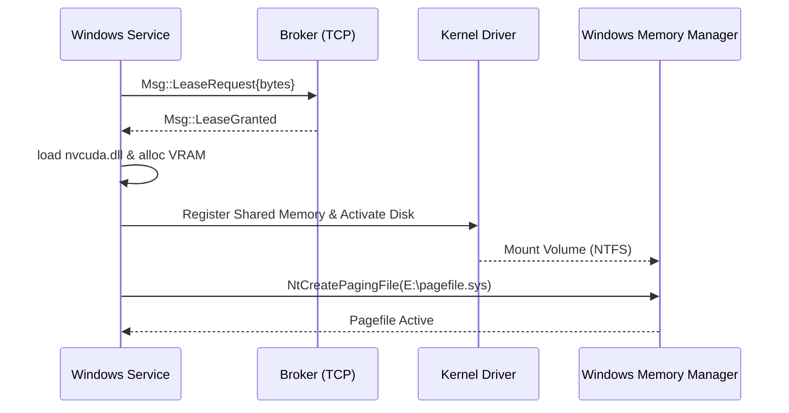

# PRD — RamShared P4 / Track 2: Swap-to-VRAM on Native Windows (StorPort virtual miniport)

## Summary

In **native Windows**, RamShared provides an equivalent mechanism to the path already validated in Linux/WSL2 (the `ramsharedd` daemon serving a `ublk` block device backed by VRAM via CUDA, used as swap — validated end-to-end). A **StorPort virtual miniport driver** written **from scratch (Day-0)** exposes a **virtual disk** to the Windows storage stack. Block I/O requests are delegated to a **userspace service (Rust)** that backs reads and writes in **VRAM** using `nvcuda.dll` (porting the existing CUDA logic). 

On top of this virtual disk, the service activates a **secondary pagefile post-boot** via the `NtCreatePagingFile` API. This allows any unmodified Windows process (such as Plex Media Server, games, or browsers) to benefit transparently from VRAM swap under memory pressure, acting as a **cold tier/overflow** storage layer over PCIe.

**Business Value:** Hardens the system under memory pressure for multi-tenant or heavy media workloads on Windows hosts without requiring application-level modifications. The VRAM swap tier acts as a high-speed, safety-net overflow layer before traditional SSD paging.

---

## Technical Context

### Services and Roles
*   **Kernel-mode Driver:** A virtual StorPort miniport driver exposing a virtual disk interface.
*   **Userspace Service (Rust):** The Windows equivalent of `ramsharedd` that communicates with the driver via IOCTLs and acts as a tenant client to the central broker.
*   **Central Broker:** The existing `ramshared-broker` daemon (running on WSL2/Linux) coordinates memory slices and leasing protocol over TCP.

### Tenant Scope
*   **Global / System-wide:** The virtual disk is presented as a physical drive to the OS. The Windows Memory Manager handles paging globally across all running processes.

### Current State (Confirmed in Codebase)
*   **WSL2/Linux Validation:** E2E validation complete. Crash safety is proven via [qemu-ublk-crash-e1b.sh](file:///home/emdev/codespace/ramshared/scripts/kernel/qemu-ublk-crash-e1b.sh). A daemon crash with swap active produces a deterministic `SIGBUS` contained within the target memory cgroup, keeping PID 1 alive.
*   **CUDA Driver Wrapper:** [crates/ramshared-cuda/src/driver.rs](file:///home/emdev/codespace/ramshared/crates/ramshared-cuda/src/driver.rs) dynamically loads CUDA symbols (`cuInit`, `cuCtxCreate_v2`, `cuMemAlloc_v2`, `cuMemcpyHtoD_v2`, `cuMemcpyDtoH_v2`, `cuMemGetInfo_v2`) via `dlopen`. The trait `VramMemory` provides safe `zero()`, `read_at()`, and `write_at()` abstractions.
*   **Broker Protocol:** Crate `ramshared-broker` specifies `Msg::LeaseRequest`, `Msg::LeaseRelease`, `Msg::LeaseGranted`, and `Msg::LeaseDenied` as newline-delimited JSON streams.
*   **VramProvider Trait:** [crates/ramshared-vram/src/lib.rs](file:///home/emdev/codespace/ramshared/crates/ramshared-vram/src/lib.rs#L61) defines the hardware-agnostic allocation interfaces.

### Confirmed in Official Documentation & Testing
*   **Attestation Signing Viability:** MS Learn "Driver Signing Options" (updated 2026-04-14) confirms that Attestation dashboard signing remains valid for Windows Desktop (Windows 10/11), bypasses the WHQL test suite, and loads on Windows 11 25H2 (build 26200) with `test-signing OFF`.
*   **StorPort Architecture:** The virtual miniport model is the modern, recommended framework for software-defined storage devices on Windows.
*   **Pass 0 Drill Results:** Hyper-V VM Windows 11 Pro drill [PASSO0-DRILL-RUNBOOK.md](file:///home/emdev/codespace/ramshared/docs/windows-vram-drive/PASSO0-DRILL-RUNBOOK.md) proved that:
    1.  Windows successfully mounts a secondary pagefile on a removable virtual disk.
    2.  Surprise removal of the backing storage under active user paging (~150-200 MB) does **not** trigger a BSOD. The affected user processes crash gracefully, analogous to `SIGBUS` on Linux.
    3.  A risk remains if kernel-paged pool allocations are paged out to the virtual disk and the backing service crashes (expected `KERNEL_DATA_INPAGE_ERROR` 0x7a bugcheck).

---

## Recommended Option

**Write a StorPort virtual miniport driver from scratch (Day-0)** while referencing **WinSpd** (for StorPort miniport setup) and **GpuRamDrive** (for CUDA memory-mapped disk proxying) as educational resources.

### Alternatives Discarded
*   **Forking ImDisk (DavidXanatos):** Discarded. ImDisk is a legacy WDM-class driver (non-StorPort) and uses a GPL-2.0 license, which imposes compliance risks for commercial distribution. Relying on its generic proxy protocol introduces architectural overhead that violates the Day-0 policy (no shims).
*   **Reviving WinSpd:** Discarded. WinSpd is a modern StorPort miniport but has been abandoned for ~5 years and never exited beta. Adopting it directly means inheriting unmaintained third-party code.

### Accepted Trade-offs
*   Writing a miniport driver from scratch increases early-stage development time, but it guarantees a clean codebase that does exactly one thing: proxy block I/O requests directly to a userspace shared-memory ring buffer.

---

## Functional Requirements

*   **RF-1 Kernel-mode StorPort Virtual Miniport**
    Exposes a virtual block device to the Windows Storage Stack. The driver does not contain CUDA or VRAM logic; it queues and redirects block I/O requests (`SCSI REQUEST_BLOCK` / SRB) to the userspace service via the backend protocol (RF-2).
    **Acceptance Criteria:** The OS lists the device in Disk Management, allows formatting as NTFS, and registers the volume path.
    **Tenant Isolation:** N/A (Global system storage device).

*   **RF-2 Driver-to-Service Protocol (Backend)**
    A custom communication channel using dedicated IOCTLs and a shared-memory ring buffer (to minimize context switches) containing request headers (`opcode`, `offset`, `length`) and completion statuses.
    **Acceptance Criteria:** Block I/O throughput via the ring buffer achieves >80% of raw memory copy speeds during synthetic loopback.
    **Tenant Isolation:** N/A (Restricted to SYSTEM/Administrators handles).

*   **RF-3 Userspace Service (Rust, Windows)**
    A background Windows service (`ramsharedwsvcd`) that handles the userspace side of the protocol (RF-2), executes reads/writes against CUDA VRAM (RF-4), and manages state transition (broker leases, pagefile setup, clean shutdown).
    **Acceptance Criteria:** Registers correctly as a Windows Service (`sc create`) and transitions between `SERVICE_START_PENDING`, `SERVICE_RUNNING`, and `SERVICE_STOPPED` without hangs.
    **Tenant Isolation:** Global service orchestration.

*   **RF-4 Port CUDA Layer to `nvcuda.dll`**
    Dynamic loader wrapper targeting `nvcuda.dll` using Windows APIs (`LoadLibraryW`, `GetProcAddress`) implementing the `VramProvider` and `VramMemory` traits, maintaining 100% API parity with the Linux CUDA backend.
    **Acceptance Criteria:** Memory allocations and data transfers (Host-to-Device / Device-to-Host) execute successfully on the native Windows GPU context.
    **Tenant Isolation:** GPU allocation contexts are bound to the service process.

*   **RF-5 Broker Tenant Client**
    The Windows service registers as a tenant to the `ramshared-broker` daemon over TCP using the JSON-lines protocol version 1, requesting lease sizes and responding to eviction flags.
    **Acceptance Criteria:** The broker log records successful lease grants and releases from the Windows tenant.
    **Tenant Isolation:** The broker isolates the Windows VRAM slice from WSL2 and other guests.

*   **RF-6 Secondary Pagefile Activation**
    Invokes the undocumented `NtCreatePagingFile` API post-boot to place a secondary pagefile on the mounted virtual disk volume.
    **Acceptance Criteria:** `Win32_PageFileUsage` queries show the pagefile active on the target drive letter with the designated capacity.
    **Tenant Isolation:** System-wide paging.

*   **RF-7 Safe Teardown and Graceful Failures**
    (a) **Ordered Shutdown:** Service disables the pagefile -> drains pending I/O -> tears down the virtual disk -> performs a VRAM `zero()` wipe -> releases the broker lease.
    (b) **Service Crash (Unclean):** Driver detects service termination and immediately fails all pending and incoming SCSI requests with a block error code (e.g., `STATUS_DEVICE_NOT_READY`), preventing infinite kernel waits.
    **Acceptance Criteria:** Force-killing the service process with active user paging results in graceful crash of the paging applications, without hanging the OS.
    **Tenant Isolation:** N/A.

*   **RF-8 Attestation-Signed Installer**
    A deployment script/installer (`.msi` or `.exe`) packaging the compiled driver (INF/CAT signed via the Microsoft Partner Center) and userspace binaries.
    **Acceptance Criteria:** The driver loads successfully on Windows 11 with `Secure Boot ON` and `test-signing OFF` without OS warnings.
    **Tenant Isolation:** N/A.

---

## Non-Functional Requirements

*   **Security & RNF-1: Zero BSOD Stability**
    A bug in a kernel driver triggers a bugcheck (BSOD). The driver must undergo memory sanitization, Driver Verifier testing under low-resource simulation, and a mandatory 48-hour continuous stress test in a VM before being loaded on physical development hosts.
    **Acceptance Criteria:** 0 BSOD events over 48 hours of heavy paging stress.

*   **RNF-2: Performance & Metrics**
    All benchmarks must adhere to the project rules: ≥3 rounds, recording median, p99, and desvio.
    *   **Latencies:** VRAM-swap (~240 µs on PCIe) will lose to high-end NVMe SSDs (~80 µs).
    *   **Gate:** The promotion criteria is **capacity relief** (pagefile-VRAM usage > 0 under system memory load) and a **bounded p99 page-in latency** (must remain within **Kx** of the host SSD latency, where K is a spec-defined constant).
    **Acceptance Criteria:** Verified logs appended to `docs/BENCHMARKS.md`.

*   **RNF-3: Day-0 Architecture**
    No backward compatibility shims or wrapper layers for third-party driver frameworks are allowed. The miniport communicates directly using SCSI commands and custom ring buffers.
    **Acceptance Criteria:** Code review approval.

*   **RNF-4: Kernel Boundary Input Validation**
    The driver must validate all incoming IOCTL buffers, alignment boundaries, and sizes before execution to prevent privilege escalation.
    **Acceptance Criteria:** Static analysis (Vera++ or similar) and manual code audit showing 100% boundary check coverage.

*   **RNF-5: Revocable Lease Enforcement**
    The VRAM allocation is treated as a revocable lease. When the broker triggers eviction, the service must execute its teardown/shrink routine within a bounded time frame.
    **Acceptance Criteria:** Lease release completes within 5 seconds of broker eviction signal under normal memory conditions.

*   **RNF-6: Non-disruptive Testing**
    Fuzzing, memory pressure simulations, and crash injections must be restricted to isolated virtual machines (QEMU/Hyper-V). Build promotion to live development hosts is gated by VM test suites.
    **Acceptance Criteria:** Automated CI/CD green status on VM runs.

*   **RNF-7: Release Signing**
    Production builds must be signed with an EV certificate and submitted to the Microsoft Partner Center for attestation signing.
    **Acceptance Criteria:** The driver signature chain resolves to Microsoft Third-Party Root Authority.

*   **RNF-8: Zero Regression on Linux**
    The porting of the CUDA layer to Windows must not alter, refactor, or break the Linux CUDA execution path.
    **Acceptance Criteria:** All existing Linux tests (`cargo test --all` on WSL2) remain green.

---

## Flows

### Provisioning (Service Start)


### Happy Path (Paging I/O)
1.  System encounters memory pressure.
2.  Windows Memory Manager decides to page out a block to the secondary pagefile on `E:`.
3.  StorPort Miniport receives the SCSI write request and posts it to the shared-memory queue.
4.  The userspace service reads the request, copies the payload to the VRAM context via `cuMemcpyHtoD_v2`.
5.  Service signals write completion back to the driver; driver notifies the OS storage stack.

### Error Path (Backend Crash Recovery)
*   **Trigger:** The userspace CUDA service crashes or freezes.
*   **Detection:** The driver's watchdog thread detects the loss of the userspace keep-alive.
*   **Action:** The driver marks the virtual disk offline and completes all outstanding SCSI requests with `STATUS_DEVICE_NOT_READY`.
*   **OS Behavior:** Windows terminates the user-space processes whose pages were lost (analogous to Linux `SIGBUS`).

---

## Data Model

*   **`VirtualDisk` Struct:** Stores disk geometry (`size_bytes`, `sectors`, `block_size`, `serial_number`) and registration state.
*   **`RingBuffer` Layout:**
    *   `producer_idx`: 32-bit atomic integer.
    *   `consumer_idx`: 32-bit atomic integer.
    *   `requests`: Array of `IoRequest` (opcode, sector_start, length, buffer_offset).
*   **`PagefileConfig` TOML Mapping:**
    ```toml
    [win_drive]
    size_mb = 4096
    pagefile_min_mb = 1024
    pagefile_max_mb = 4096
    priority = 100
    broker_address = "127.0.0.1:7000"
    ```

---

## API / Interfaces

### Driver IOCTLs
*   `IOCTL_RAMSHARED_REGISTER_RING`: Maps the shared memory buffer from userspace.
*   `IOCTL_RAMSHARED_START_DEVICE`: Signals the driver to expose the virtual disk to MountMgr.
*   `IOCTL_RAMSHARED_STOP_DEVICE`: Gracefully unmounts the disk.

### Central Broker Connection
*   `TCP socket` to broker. Version: `1`. Payload format: JSON-lines.
*   Outbound: `{"type": "LeaseRequest", "size_bytes": 4294967296}`.
*   Inbound: `{"type": "LeaseGranted", "lease_id": "win-01"}`.

---

## Dependencies & Risks

| Risk ID | Risk Description | Mitigation Strategy |
|---|---|---|
| **R1** | Kernel driver bug check (BSOD) on development host. | Restrict development and testing to Hyper-V VMs with Driver Verifier active; enforce 48h automated stress runs before host testing. |
| **R2** | Microsoft Attestation signing requirements change. | Monitor Windows Hardware Developer policies; maintain EV certificate credentials; prepare WHCP/HLK pipeline as a backup. |
| **R3** | `NtCreatePagingFile` API deprecated or blocked in newer builds. | Isolate the paging API call within a fallback module; if blocked, degrade gracefully to a standard NTFS virtual drive (without pagefile support). |
| **R4** | Unclean service crash causes system instability. | Implement absolute timeouts in the virtual miniport to fail I/O requests immediately if the userspace service stops responding. |

---

## Implementation Strategy

*   **Phase 0 (Drill Validation):** Run the surprise-removal drill in a VM [PASSO0-DRILL-RUNBOOK.md](file:///home/emdev/codespace/ramshared/docs/windows-vram-drive/PASSO0-DRILL-RUNBOOK.md) to log kernel stability metrics (Completed).
*   **Phase 1 (CUDA Loader Port):** Build the Windows userspace wrapper around `nvcuda.dll` and verify memory transfer limits on the Windows host.
*   **Phase 2 (Driver Skeleton):** Implement the StorPort virtual miniport skeleton. Load in a VM under test-signing mode.
*   **Phase 3 (I/O Loop):** Integrate the shared-memory queue between the driver and the Rust service. Verify raw block read/write rates.
*   **Phase 4 (Pagefile Integration):** Mount the volume, call `NtCreatePagingFile`, and perform synthetic memory stress tests in a VM.
*   **Phase 5 (Production Signature):** Sign the driver binaries via Microsoft Partner Center and execute the final E2E test on the host system.

---

## Out of Scope
*   Exposing the virtual disk to network paths or remote mount protocols (SMB/NFS).
*   Supporting non-NVIDIA GPUs (Vulkan/D3D12 paging tiers) in this phase.
*   Kernel-level memory compression or deduplication on the virtual disk sector data.
*   Bypassing the post-boot restriction (mounting `pagefile.sys` at early boot phase before userspace starts).
